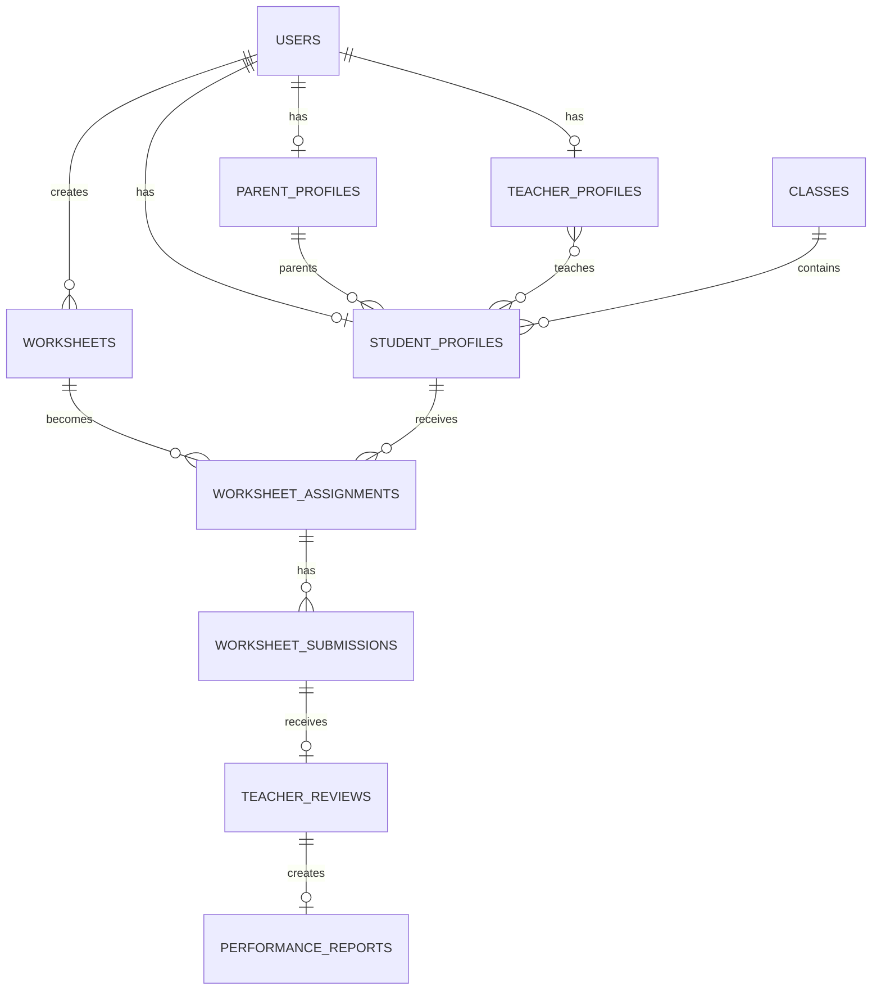

# Database Documentation

## Overview

The main database is PostgreSQL. Each table stores one type of record. A foreign key is a column that points to a record in another table. It keeps related data connected.

All normal record tables also contain `created_at` and `updated_at`, unless stated otherwise. These record when a row was created and last changed.

## Identity and security tables

### `users`

**Purpose:** Stores the common account used to sign in.

| Column | Meaning |
|---|---|
| `id` | Internal account number |
| `name` | Display name |
| `email` | Unique login email |
| `email_verified_at` | Verification time; currently not enforced |
| `password` | Safely hashed password |
| `remember_token` | Laravel web-session helper; the React API login does not rely on it |
| `role` | Primary role: admin, teacher, parent, or student |

One user may have one role-specific profile, many stored role links, created assignments, uploaded submissions, messages, and API tokens. The system uses this record at login and for audit fields such as who assigned or uploaded work.

### `parent_profiles`

**Purpose:** Stores parent-only information.

Columns are `id`, unique `user_id`, and optional `phone`. One profile belongs to one user and can be linked to many student profiles through `student_profiles.parent_id`. It is used to limit a parent to their own children.

### `teacher_profiles`

**Purpose:** Stores teacher-only information.

Columns are `id`, unique `user_id`, optional unique `employee_number`, and optional `specialization`. A teacher can link to students, classes, subjects, reviews, and older worksheet creator fields. It is used to decide which student work a teacher may view and review.

### `student_profiles`

**Purpose:** Stores the learner identity and family/class links.

| Column | Meaning |
|---|---|
| `id` | Internal learner profile number |
| `user_id` | Unique account for the student |
| `parent_id` | Optional direct parent profile |
| `class_id` | Optional school class |
| `student_number` | Optional unique school identifier |
| `date_of_birth` | Optional birth date |
| `grade_level` | Optional year or grade |

A student has assignments, reports, linked teachers, and submissions through assignments. The current rule supports one parent profile per student and many children per parent.

### `roles`

**Purpose:** Defines system roles and their preferred portal.

Columns are `id`, human-friendly `name`, unique `slug`, optional `portal_path`, numeric `priority`, and `is_system`. The migrations seed Admin, Teacher, Parent, and Student. Priority chooses the portal if a user has more than one stored role.

### `permissions`

**Purpose:** Names individual capabilities such as managing worksheets or viewing progress.

Columns are `id`, `name`, unique `slug`, `group`, and optional `description`. Permissions are grouped for organization. The current endpoints mainly use direct role checks, so this permission system is only partly used at runtime.

### `user_roles`

**Purpose:** Links users to roles and records who assigned each role.

Columns are `user_id`, `role_id`, optional `assigned_by`, and `assigned_at`. The user and role together form the unique key. It supports database-driven portal selection and permission checks.

### `role_permissions`

**Purpose:** Links roles to allowed capabilities.

Columns are `role_id`, `permission_id`, `created_at`, and `updated_at`. The role and permission together are unique. Administrators receive all seeded permissions; other roles receive selected permissions, although current routes still use role-specific rules in most places.

### `personal_access_tokens`

**Purpose:** Stores Laravel Sanctum API login tokens.

Columns are `id`, the account type and ID (`tokenable_type`, `tokenable_id`), token `name`, unique hashed `token`, optional `abilities`, `last_used_at`, optional `expires_at`, and timestamps. Login creates a token; logout deletes the current token.

### `password_reset_tokens`

**Purpose:** Standard Laravel storage for password reset tokens.

Columns are primary-key `email`, `token`, and optional `created_at`. The table exists, but this project has no password-reset API or working screen.

## Academic structure tables

### `teacher_student`

**Purpose:** Links teachers to the students they teach.

Columns are `teacher_id`, `student_id`, and timestamps. Each teacher/student pair is unique. This relationship controls the teacher directory, assignment visibility, submission downloads, and review permission.

### `classes`

**Purpose:** Describes a school class or homeroom.

Columns are `id`, `name`, unique `code`, `grade_level`, `academic_year`, optional `homeroom_teacher_id`, optional `starts_on` and `ends_on`, and `is_active`. The end date cannot be earlier than the start date in PostgreSQL. Students may belong to a class. No class-management endpoint or screen currently exists.

### `subjects`

**Purpose:** Stores formal subjects for academic planning.

Columns are `id`, `name`, unique `code`, optional `description`, and `is_active`. Subjects connect teachers and classes through teaching assignments. Worksheet `subject` is currently free text and does not point to this table.

### `teaching_assignments`

**Purpose:** States that one teacher teaches one subject to one class.

Columns are `id`, `teacher_id`, `class_id`, `subject_id`, and timestamps. The three IDs together must be unique. Models use the relationship, but there is no active management API.

## Worksheet workflow tables

### `worksheets`

**Purpose:** Stores a learning resource and information about its private file.

| Column | Meaning |
|---|---|
| `id` | Worksheet number |
| `created_by` | Administrator user who created it |
| `teacher_id` | Optional legacy teacher owner |
| `title`, `description` | Name and explanation |
| `subject`, `grade_level` | Classification used for display and filters |
| `instructions` | Directions for learners |
| `file_path` | Private server path |
| `original_filename`, `mime_type`, `file_size` | Original file details |
| `default_total_marks` | Suggested total for teacher review |
| `default_due_days` | Suggested days until due |
| `is_published` | Whether parents can browse and assign it |

Worksheets connect to bundles and assignments. Only administrators can create, edit, and delete them. An assigned worksheet cannot be deleted.

### `worksheet_bundles`

**Purpose:** Names a reusable collection of worksheets.

Columns are `id`, `created_by`, optional legacy `teacher_id`, `title`, optional `description`, and `is_published`. A bundle belongs to its creator and contains worksheets through `bundle_worksheet`. The API supports bundles, but the active frontend does not.

### `bundle_worksheet`

**Purpose:** Places worksheets inside bundles in a chosen order.

Columns are `bundle_id`, `worksheet_id`, `position`, and timestamps. The bundle/worksheet pair is unique. `position` controls display order.

### `worksheet_assignments`

**Purpose:** Records that a worksheet was assigned to one student.

| Column | Meaning |
|---|---|
| `id` | Assignment number |
| `worksheet_id` | Assigned resource |
| `student_id` | Recipient |
| `assigned_by` | Parent or administrator user |
| `instructions` | Assignment-specific directions |
| `assigned_at` | Assignment time |
| `due_at` | Optional deadline |
| `allow_resubmission` | Whether another attempt is allowed |
| `allow_late_submission` | Whether uploads after the deadline are allowed |
| `status` | `assigned`, `submitted`, or `checked` |

An assignment has many submission attempts. The server updates its status as work moves through the workflow.

### `worksheet_submissions`

**Purpose:** Stores one uploaded attempt at an assignment.

Columns are `id`, `assignment_id`, `attempt_number`, `uploaded_by`, private file information (`file_path`, `original_filename`, `mime_type`, `file_size`), optional `student_note`, `submitted_at`, and timestamps. The assignment and attempt number together are unique. A submission can have one teacher review.

### `teacher_reviews`

**Purpose:** Stores a teacher's evaluation of one submission attempt.

Columns are `id`, unique `submission_id`, `teacher_id`, optional `obtained_marks`, `total_marks`, calculated `percentage`, optional `remarks`, `status`, optional `checked_at`, and timestamps. A checked review must have valid marks, a percentage from 0 to 100, and a checked time. It can create one report.

### `performance_reports`

**Purpose:** Gives a student-facing result created from a checked review.

Columns are `id`, `student_id`, unique `review_id`, `overall_grade`, `progress` from 0 to 100, optional `teacher_comment`, and timestamps. It is used on dashboards and progress endpoints.

## Communication and framework tables

### `direct_messages`

**Purpose:** Stores a private message from one user to another.

Columns are `id`, `sender_id`, `recipient_id`, optional `subject`, `body`, optional `read_at`, and timestamps. PostgreSQL prevents sending to the same account. The model and table exist, but no messaging endpoint or active page exists.

### `failed_jobs`

**Purpose:** Standard Laravel storage for failed background jobs.

Columns are `id`, unique `uuid`, `connection`, `queue`, serialized `payload`, error `exception`, and `failed_at`. The project currently uses the synchronous queue, so normal LMS actions run immediately rather than as queued jobs.

## Data ownership summary

- Deleting a user deletes that user's profile, role links, tokens, and direct messages.
- Deleting a student deletes their assignments, submissions, reviews, and reports through linked rules.
- Deleting a submission deletes its review and report.
- Worksheet creators and assignment/file uploaders use restricted deletion rules so audit history is not silently broken.
- A removed parent or class link becomes empty rather than deleting the student.
