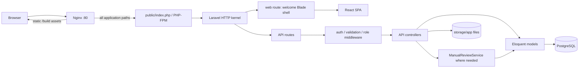
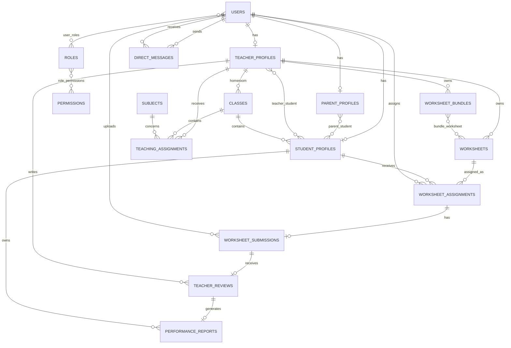
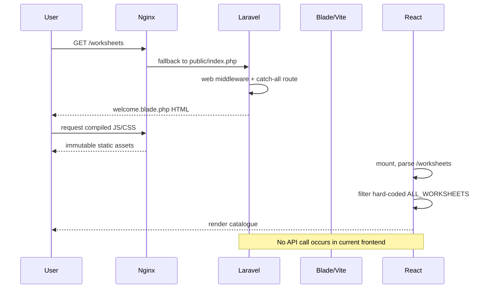
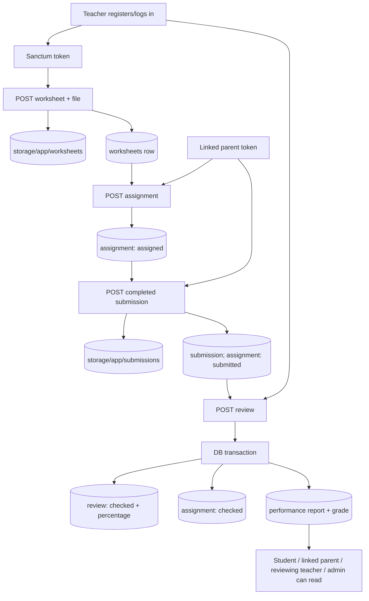

# EduSphere LMS — Complete Reverse-Engineering and Viva Guide

> **Post-analysis update:** The business-rule implementation dated 3 August 2026 changes several findings in this original baseline report. See `docs/BUSINESS_REQUIREMENTS_IMPLEMENTATION.md` for the new canonical worksheet ownership, parent relationship, authorization, APIs, frontend integration, and verification results.

> Repository examined: `lms`  
> Analysis date: 3 August 2026  
> Scope: all custom application, configuration, infrastructure, database, frontend, and test files. Generated dependencies (`vendor/`, `node_modules/`), caches, logs, compiled output, binary internals, and framework-generated lock-file package metadata are inventoried but not read as custom source.

## 1. Executive repository overview

### 1.1 Identity and purpose

The product name shown by the UI is **EduSphere**. Composer still calls the package `laravel/laravel`, `.env.example` still says `APP_NAME=Laravel`, and the stock Laravel README was never replaced. The intended product is a primary-school learning management system for students, parents, teachers, and administrators. It combines a public catalogue/marketing experience with a backend workflow in which a teacher uploads a worksheet, a parent or teacher assigns it to a linked student, a parent uploads completed work, a teacher manually reviews it, and the system creates a performance report.

The practical problem is coordinating printable learning work and human marking. A worksheet is not merely downloadable content: the backend tracks ownership, learner assignment, submission file, score, grade, remarks, and progress report. Separate schema objects model school classes, subjects, teacher/class/subject allocations, parent–student and teacher–student links, direct messages, roles, and permissions.

### 1.2 What is actually complete versus demonstrated

The repository contains two unequal layers:

1. **A functioning Laravel JSON API** for identity, bearer-token authentication, worksheets, bundles, assignments, submissions, teacher reviews, and performance reports. Its primary workflow is covered by passing feature tests.
2. **A rich React prototype/marketing SPA** driven almost entirely by hard-coded JavaScript data. Its login and signup forms only write to the browser console. It does not call the Laravel API, store a Sanctum token, or expose most of the included LMS pages through the active router.

Therefore this is best described as a **backend vertical slice plus a frontend design prototype**, not a finished end-to-end LMS. Backend tests pass (6 tests, 26 assertions). The local frontend production build could not be validated because the installed `esbuild` process was denied access while traversing a parent directory in this managed Windows/OneDrive environment; independent static reading also identifies a real source-level problem: several dormant pages import `StatusChip`, `TableSkeleton`, `StatCard`, `BarChart`, `ProgressRing`, `Modal`, and `ListSkeleton` from `components/ui/UI.jsx`, but that file exports none of them. Those imports would fail if the dormant pages were wired into the bundle.

### 1.3 Main features found

- Public landing page with animated hero, featured worksheets, journey, progress, events, testimonials, newsletter, FAQ, pricing, help, and about content.
- In-memory catalogue browsing for worksheets, activities, workbooks, and courses, including search, filtering, pagination, favourites, recently viewed, and recently downloaded state.
- Prototype LMS screens for dashboard, assignments, learning, quizzes, certificates, calendar, discussions, bookmarks, notifications, profile, analytics, settings, wishlist, role landing pages, terms, privacy, services, contact, and password reset.
- Registration for parent, teacher, or student accounts in the API.
- Login/logout through Laravel Sanctum personal access tokens.
- Database-backed roles, permissions, portal priorities, and role middleware.
- User subtype profiles and parent/teacher-to-student links.
- Teacher-owned file-backed worksheets and ordered worksheet bundles.
- Parent/teacher worksheet assignment with due dates and instructions.
- Parent submission upload and replacement.
- Teacher-only manual review, calculated percentage and grade, and transactional performance-report generation.
- Academic class/subject/teaching-assignment schema and direct-message schema (models and tests exist, but no corresponding APIs/UI integration).
- Dockerized PHP-FPM + Nginx + PostgreSQL deployment topology.

### 1.4 Technology matrix

| Area | Technology | Role in this repository |
|---|---|---|
| Backend language | PHP 8.1+ (container uses 8.2) | Controllers, models, requests, services, migrations, configuration, tests |
| Backend framework | Laravel 10 | MVC foundation, routing, IoC, validation, ORM, storage, middleware |
| ORM | Eloquent | Models, relationships, eager loading, query scoping, persistence |
| Database | PostgreSQL 16 in Docker | Production-intended relational store; tests use in-memory SQLite |
| Authentication | Laravel Sanctum 3 | Personal access bearer tokens created on register/login |
| Authorization | Custom RBAC plus ownership checks | `roles`, `permissions`, pivots, `RequireRole`, `RequirePermission`, controller checks |
| Frontend language | JavaScript/JSX and CSS | SPA prototype |
| Frontend framework | React 19 | Components, hooks, context, rendering |
| Bundler | Vite 4 + Laravel Vite plugin + React plugin | Development server and production bundle |
| HTTP client | Axios | Installed and assigned to `window.axios`, but no application API calls exist |
| Testing | PHPUnit 10 / Laravel testing | Unit, HTTP workflow, RBAC and relationship tests |
| Web server | Nginx 1.27 | Static files and FastCGI proxy to PHP-FPM |
| Containers | Docker multi-stage + Compose | Composer install, frontend build, PHP runtime, Nginx, PostgreSQL |

The API style is REST-like JSON under `/api`, with resource endpoints plus workflow actions (`download`, `submission`, `review`, `logout`). Architecture is Laravel MVC enhanced with Form Requests and one domain service (`ManualReviewService`), alongside a client-rendered React SPA using Context and a handwritten History API router. There is no Redux, GraphQL, WebSocket implementation, queue job, repository layer, policy class, event/listener, notification class, or custom Artisan command.

### 1.5 Overall architecture and request boundaries



The intended browser-to-API arrow is currently missing in application code. Axios is initialized, but React never calls it. Public React data comes from `resources/js/data/*`, while the Laravel API remains independently usable by an API client.

## 2. Repository tree and folder responsibilities

```text
lms/
├── app/
│   ├── Console/Kernel.php
│   ├── Exceptions/Handler.php
│   ├── Http/
│   │   ├── Controllers/Api/{Auth,PerformanceReport,TeacherReview,
│   │   │   WorksheetAssignment,WorksheetBundle,Worksheet,
│   │   │   WorksheetSubmission}Controller.php
│   │   ├── Controllers/Controller.php
│   │   ├── Middleware/{Authenticate,EncryptCookies,PreventRequestsDuringMaintenance,
│   │   │   RedirectIfAuthenticated,RequirePermission,RequireRole,TrimStrings,
│   │   │   TrustHosts,TrustProxies,ValidateSignature,VerifyCsrfToken}.php
│   │   ├── Requests/{StoreAssignment,StoreBundle,StoreSubmission,
│   │   │   StoreTeacherReview,StoreWorksheet}Request.php
│   │   └── Kernel.php
│   ├── Models/{DirectMessage,ParentProfile,PerformanceReport,Permission,Role,
│   │   SchoolClass,StudentProfile,Subject,TeacherProfile,TeacherReview,
│   │   TeachingAssignment,User,Worksheet,WorksheetAssignment,
│   │   WorksheetBundle,WorksheetSubmission}.php
│   ├── Providers/{App,Auth,Broadcast,Event,Route}ServiceProvider.php
│   └── Services/ManualReviewService.php
├── bootstrap/{app.php,cache/.gitignore}
├── config/{app,auth,broadcasting,cache,cors,database,filesystems,hashing,
│   logging,mail,queue,sanctum,services,session,view}.php
├── database/
│   ├── factories/UserFactory.php
│   ├── migrations/ (10 migration files)
│   └── seeders/{DatabaseSeeder,LmsDemoSeeder}.php
├── docker/{entrypoint.sh,nginx.conf,php.ini}
├── docs/{manual-review-workflow.md,PROJECT_REVERSE_ENGINEERING.md}
├── public/{index.php,robots.txt,favicon.ico,build generated when built}
├── resources/
│   ├── css/app.css
│   ├── js/
│   │   ├── components/ (18 JSX, 17 component CSS, ui/UI.jsx + UI.css)
│   │   ├── context/AppContext.jsx
│   │   ├── data/ (10 JavaScript data modules)
│   │   ├── pages/ (39 JSX pages, pages.css, lms.css)
│   │   ├── router/Router.jsx
│   │   ├── assets/{hero.png,react.svg,vite.svg}
│   │   └── {app.jsx,bootstrap.js,FrontendApp.jsx,Main.jsx,index.css,App.css}
│   └── views/welcome.blade.php
├── routes/{api,channels,console,web}.php
├── storage/app and framework/log subtrees (runtime; `.gitignore` placeholders)
├── tests/{CreatesApplication.php,TestCase.php,Feature/*,Unit/*}
├── vendor/ and node_modules/ (generated dependencies; excluded)
├── .env, .env.example, editor/Git/Docker ignore files
├── artisan, composer.json, composer.lock, package.json, package-lock.json
├── Dockerfile, docker-compose.yml, phpunit.xml, vite.config.js
└── README.md, composer-build.log, .phpunit.result.cache
```

### 2.1 Folder-by-folder analysis

| Folder | Custom/relevant files | Purpose and why it exists | Most important files | Communicates with |
|---|---:|---|---|---|
| `app/Http/Controllers/Api` | 7 | HTTP orchestration: receives validated requests, performs access checks, invokes models/services, returns JSON/files | all seven controllers | routes, Form Requests, models, service, storage |
| `app/Http/Requests` | 5 | Centralizes input validation and coarse role authorization before controllers execute | all five | controllers, authenticated user, validation engine |
| `app/Http/Middleware` | 12 | Framework request pipeline plus custom role/permission gates | `RequireRole`, `RequirePermission` | HTTP kernel, routes, user model |
| `app/Models` | 16 | Eloquent representation of every domain table and relationship | `User`, worksheet workflow models, profile/RBAC models | controllers, service, migrations/schema, seeders, tests |
| `app/Services` | 1 | Keeps multi-record manual review transaction and grading out of controller | `ManualReviewService` | review controller, review/report/assignment models, DB transaction |
| `app/Providers` | 5 | Laravel bootstrapping and route/rate-limit registration | `RouteServiceProvider` | framework, route files, HTTP kernel |
| `app/Console`, `app/Exceptions` | 2 | Framework console scheduling/commands and exception registration | framework-default kernels | Artisan, framework |
| `bootstrap` | 2 | Creates Laravel application/container and runtime cache directory | `app.php` | public front controller, console entry, kernels |
| `config` | 16 | Environment-driven framework configuration | `database`, `auth`, `sanctum`, `cors`, `filesystems`, `session` | `.env`, providers, framework services |
| `database/migrations` | 10 | Versioned creation of 22 application/framework tables and constraints | six 2026 LMS migrations | PostgreSQL/SQLite, Eloquent, tests, Docker entrypoint |
| `database/seeders` | 2 | Local/testing demo identities and links | `LmsDemoSeeder` | user/profile models and DB |
| `database/factories` | 1 | Test user generation | `UserFactory` | Faker, feature tests, `User` |
| `resources/js/components` | 36 JSX/CSS | Reusable marketing UI, authentication prototype, effects, and primitives | `Navbar`, `Login`, `Signup`, `Hero`, `UI.jsx` | `FrontendApp`, data modules, router/context, CSS |
| `resources/js/pages` | 41 | Catalogue and LMS prototype screens | active: `Worksheets`, `WorksheetDetails`, `Activities`, `ActivityDetails`, `Pricing`, `About`, `Help`, `NotFound`; remainder dormant | router/context, data modules, UI primitives |
| `resources/js/data` | 10 | Static demo domain records and generator functions | worksheet/activity/course/workbook and `lmsData` | React components/pages only; not database seeds |
| `resources/js/context` | 1 | In-memory shared favourites/recent history state | `AppContext.jsx` | catalogue/detail pages, dormant dashboard/profile/settings |
| `resources/js/router` | 1 | Minimal client router using `history.pushState` | `Router.jsx` | Navbar, Links, active pages |
| `resources/views` | 1 | HTML shell containing React mount point and Vite tags | `welcome.blade.php` | web route, Vite, `app.jsx` |
| `routes` | 4 | Declares API, SPA fallback, broadcast authorization, console closure command | `api.php`, `web.php` | Route provider, controllers, middleware |
| `tests` | 6 | Bootstrap and automated proof of HTTP/domain behavior | two substantive feature suites | migrations, SQLite, Sanctum, models/controllers/service |
| `docker` + root container files | 6 | Reproducible production-like runtime | `Dockerfile`, Compose, entrypoint, Nginx config | PHP-FPM, PostgreSQL, Vite build, storage volume |
| `public` | 3 custom/generated entry files | Web document root | `index.php` | Nginx, bootstrap, compiled assets |
| `storage` | placeholder files + runtime | Private worksheet/submission files, sessions, cache, views, logs | runtime-generated | Laravel Storage, session/cache/logging, Docker volume |
| `vendor`, `node_modules` | generated | Composer/NPM dependency code; not project-authored | lock files describe versions | runtime/build tools |

## 3. Complete important-file inventory

Line counts are physical text lines as observed; binary assets show no meaningful source LOC. “Used by” describes runtime or development callers, not merely conceptual relevance.

### 3.1 Backend and routes

| File | Type / LOC | Purpose | Used by / depends on | Importance |
|---|---:|---|---|---|
| `routes/api.php` | PHP / 31 | Declares all 23 custom API route-method combinations | Route provider; controllers, Sanctum, role/throttle middleware | High |
| `routes/web.php` | PHP / 15 | SPA fallback excluding `/api` | browser; Blade view | High |
| `routes/channels.php` | PHP / 15 | Authorizes a user-specific broadcast channel | Broadcast provider; currently no active Echo/events | Low |
| `routes/console.php` | PHP / 16 | Default `inspire` closure command | Artisan | Low |
| `AuthController.php` | PHP / 77 | Registration, login, logout, token payload | API routes; users/profiles, Hash, DB, Sanctum | High |
| `WorksheetController.php` | PHP / 62 | List/upload/view/download/delete worksheets | routes; request/model/storage | High |
| `WorksheetBundleController.php` | PHP / 35 | List/create/view ordered bundles | routes; worksheet/bundle models | High |
| `WorksheetAssignmentController.php` | PHP / 66 | Scoped list/create/view assignments | routes; assignment, worksheet, student models | High |
| `WorksheetSubmissionController.php` | PHP / 69 | Upload/replace/view/download submissions | routes; DB, Storage, assignment/submission models | High |
| `TeacherReviewController.php` | PHP / 50 | List/create/update/view manual reviews | routes; Form Request, service, review/submission models | High |
| `PerformanceReportController.php` | PHP / 31 | Role-scoped report list/view | routes; report model | High |
| `Controller.php` | PHP / 9 | Base Laravel controller traits | all controllers | Medium |
| five `Store*Request.php` files | PHP / 17–23 each | Role authorization and field/file rules | matching controller methods | High |
| `ManualReviewService.php` | PHP / 63 | Atomic score/review/assignment/report state transition | review controller; DB and four models | High |
| `RequireRole.php` | PHP / 13 | Variadic role gate | review routes via alias | High |
| `RequirePermission.php` | PHP / 17 | Permission-slug gate | registered alias; no route currently uses it | Medium |
| other 10 middleware files | PHP / 14–25 | Laravel defaults: authentication redirect, cookies, proxies, CSRF, maintenance, trimming, signatures | HTTP kernel/framework | Medium/Low |
| `app/Http/Kernel.php` | PHP / 63 | Global, web, API middleware and aliases | Laravel HTTP kernel | High |
| `RouteServiceProvider.php` | PHP / 41 | Loads API/web routes and defines 60/minute limiter | framework boot | High |
| other four providers | PHP / 15–33 | Framework/default service, auth policy, event, broadcast boot | Laravel boot | Low/Medium |
| `Exceptions/Handler.php` | PHP / 42 | Default reportable exceptions and non-flashed inputs | framework | Medium |
| `Console/Kernel.php` | PHP / 22 | Default scheduler and console command discovery | Artisan | Low |

### 3.2 Domain models and database files

| File/group | Type / LOC | Purpose | Used by / depends on | Importance |
|---|---:|---|---|---|
| `User.php` | PHP / 114 | Authenticatable identity, hashed password, profiles, RBAC helpers, portal resolution | auth, controllers, middleware, seed/tests | High |
| `ParentProfile.php` | PHP / 19 | Parent subtype and parent–student relation | auth/assignment/report logic | High |
| `TeacherProfile.php` | PHP / 63 | Teacher subtype and all teacher domain relations | worksheet/review/academic logic | High |
| `StudentProfile.php` | PHP / 46 | Learner subtype and class/family/teacher/work relations | assignments/reports/auth | High |
| `Worksheet.php` | PHP / 31 | File metadata, owner, bundles, assignments | worksheet/bundle/assignment controllers | High |
| `WorksheetBundle.php` | PHP / 21 | Ordered group of worksheets | bundle controller | High |
| `WorksheetAssignment.php` | PHP / 29 | Worksheet-to-student work unit and state | assignment/submission/review flows | High |
| `WorksheetSubmission.php` | PHP / 25 | One uploaded response per assignment | submission/review flows | High |
| `TeacherReview.php` | PHP / 30 | One teacher assessment per submission | review/report service and APIs | High |
| `PerformanceReport.php` | PHP / 20 | One learner report per review | service/report API | High |
| `Role.php`, `Permission.php` | PHP / 25, 16 | Database RBAC entities | `User`, migrations, middleware/tests | High |
| `SchoolClass.php`, `Subject.php`, `TeachingAssignment.php` | PHP / 48, 34, 21 | Academic timetable/class relationship graph | tests and future APIs | Medium |
| `DirectMessage.php` | PHP / 20 | Sender/recipient message relation | relationship test; no API | Medium |
| four framework migrations (2014/2019) | PHP / 25–30 | Users, password reset tokens, failed jobs, Sanctum tokens | framework/auth/queue/Sanctum | High/Medium |
| `000001_create_lms_identity_tables.php` | PHP / 65 | role column, three profiles, family/teacher pivots | identity models | High |
| `000002_create_worksheet_tables.php` | PHP / 56 | worksheets, bundles, ordered pivot | worksheet models/APIs | High |
| `000003_create_assignment_and_submission_tables.php` | PHP / 47 | assignments and one-to-one submissions | workflow | High |
| `000004_create_manual_review_and_report_tables.php` | PHP / 44 | reviews, reports and check constraints | workflow | High |
| `000005_create_rbac_tables.php` | PHP / 126 | RBAC schema, data migration, grants | auth/authorization | High |
| `000006_create_academic_portal_tables.php` | PHP / 76 | classes, subjects, allocations, messages, student class FK | academic models | High |
| `DatabaseSeeder.php`, `LmsDemoSeeder.php` | PHP / 16, 45 | environment-guarded demo data | Artisan/local development | Medium |
| `UserFactory.php` | PHP / 37 | fake users with default student role/password | tests | Medium |

### 3.3 Frontend file inventory

| File/group | Type / LOC | Purpose and connectivity | Importance |
|---|---:|---|---|
| `resources/views/welcome.blade.php` | Blade/PHP / 18 | HTML metadata, fonts, `#app`, Vite entry | High |
| `resources/js/app.jsx` | JSX / 14 | React root bootstrap under StrictMode | High |
| `FrontendApp.jsx` | JSX / 121 | Active route switch, shell, homepage composition | High |
| `router/Router.jsx` | JSX / 52 | custom router, query parsing, navigate, Link | High |
| `context/AppContext.jsx` | JSX / 27 | in-memory favourites/recent lists | High |
| `bootstrap.js` | JS / 26 | global Axios defaults; dormant Echo sample | Medium |
| `Main.jsx` | JSX / 7 | unused starter component | Low/dead |
| `components/Login.jsx`, `Signup.jsx` | JSX / 85, 107 | controlled prototype forms; console-only submission | High because auth UX is misleading |
| `Navbar.jsx`, `Footer.jsx` | JSX / 95, 53 | active shell navigation | High |
| `Hero.jsx` | JSX / 98 | rotating words, count-up animation, tilt cards | High |
| `Reveal.jsx`, `ScrollProgress.jsx` | JSX / 31, 23 | intersection reveal and scroll progress effects | Medium |
| `Intro`, `Featured`, `FeatureJourney`, `WaveBand`, `Popular`, `Events`, `LearnMore`, `Testimonials`, `Newsletter`, `Faq` | JSX / 24–62 each | homepage content and small interactions | Medium |
| `components/ui/UI.jsx` | JSX / 65 | exports Skeleton, CardSkeleton, EmptyState, Pagination, FavoriteButton, PageHero | High; incomplete relative to imports |
| active catalogue/detail pages | JSX / 55–104 each | `Worksheets`, `WorksheetDetails`, `Activities`, `ActivityDetails`, `Pricing`, `About`, `Help`, `NotFound` | High |
| dormant catalogue pages | JSX / 67–132 each | courses, workbooks, subjects, events, search | Medium; not routed |
| dormant LMS pages | JSX / 40–158 each | dashboard, assignments, learning, quiz, profile, etc. | Medium; mock-only and not routed |
| role wrappers `Student`, `Parent`, `Educator` | JSX / 4 each | pass a role to `RoleLanding` | Low/dormant |
| ten `data/*.js` modules | JS / 5–108 | hard-coded/generator-based UI data | High for understanding current UI; no backend connection |
| 20 CSS files | CSS / 0–165 measured text lines | global/component/page visual system | Medium; presentation only |
| `hero.png`, `react.svg`, `vite.svg` | image/vector | bundled assets; none imported by active application | Low/unused |

### 3.4 Root, configuration, infrastructure, and tests

| File/group | Type / LOC | Purpose | Importance |
|---|---:|---|---|
| `composer.json` / `composer.lock` | JSON/lock / 68, 8215 | PHP requirements, scripts, exact dependency graph | High |
| `package.json` / `package-lock.json` | JSON / 18, 2086 | frontend scripts and exact NPM graph | High |
| `.env` / `.env.example` | env / 51-key template | local secrets/runtime values and safe template | High; `.env` values must never be documented/committed |
| 16 `config/*.php` files | PHP / 23–182 | framework service configuration | High/Medium |
| `Dockerfile` | Docker / 38 | four-stage Composer/frontend/PHP/Nginx build | High |
| `docker-compose.yml` | YAML / 69 | app, Nginx, PostgreSQL, networks/volumes | High |
| `docker/entrypoint.sh` | shell / 46 | writable dirs, persistent generated key, DB readiness, migrations | High |
| `docker/nginx.conf`, `php.ini` | config / 33, 11 | routing/security/cache/upload/runtime limits | High |
| `public/index.php`, `bootstrap/app.php`, `artisan` | PHP / 44, 47, 43 | web and CLI framework boot | High |
| `vite.config.js`, `phpunit.xml` | JS/XML / 17, 31 | build and test configuration | High |
| `ManualWorksheetWorkflowTest.php` | PHP / 91 | end-to-end backend workflow plus unauthorized parent case | High |
| `RbacAcademicArchitectureTest.php` | PHP / 62 | RBAC portal and academic/message relationship proof | High |
| remaining four test bootstrap/example files | PHP / 7–16 | Laravel test boot and starter smoke/unit tests | Medium/Low |
| `README.md` | Markdown / 45 | unchanged generic Laravel README | Low and a documentation defect |
| `docs/manual-review-workflow.md` | Markdown / 27 | concise backend workflow and Docker commands | Medium |
| `.editorconfig`, `.gitignore`, `.gitattributes`, `.dockerignore` | config | repository/tool hygiene | Medium |
| `composer-build.log`, `.phpunit.result.cache` | generated | prior tool output/cache, not custom source | Low; should generally not be committed |

## 4. Backend file-by-file and function-by-function reading

This section explains purpose, execution time, callers, imports, exports, control flow, output, dependencies, and interview significance. PHP files export their declared class through Composer PSR-4 autoloading unless they are route/config/migration files, which return closures or arrays.

### 4.1 Routing and request boot

#### `public/index.php`, `bootstrap/app.php`, and `app/Http/Kernel.php`

`public/index.php` is the web-server entry point. It records the framework start time, loads Composer’s generated autoloader, requires `bootstrap/app.php`, resolves the bound HTTP kernel, converts PHP globals into an HTTP request, handles it, sends the response, then calls `terminate` for after-response work. It is invoked for any Nginx request that is not served as a static file.

`bootstrap/app.php` creates `Illuminate\Foundation\Application` rooted one directory above `bootstrap`. Three singleton bindings tell the container which HTTP kernel, console kernel, and exception handler implement Laravel’s contracts. Returning the application instead of immediately running it lets both `artisan` and `public/index.php` use the same container.

`Http\Kernel` defines the pipeline. Global middleware trusts configured proxies, applies CORS, blocks maintenance-mode traffic, validates body size, trims strings, and converts empty strings to `null`. The `web` group adds encrypted cookies, session, shared validation errors, CSRF, and route-model binding. The `api` group applies the named API throttle and model binding; Sanctum’s stateful-SPA middleware is commented out, so the implemented contract is bearer tokens, not cookie-authenticated SPA requests. Aliases register `role` and `permission` alongside Laravel defaults.

Practical flow: Nginx → `index.php` → container → HTTP kernel → global middleware → route-group middleware → route middleware → controller → response through middleware in reverse order.

**Viva question:** Why is `SubstituteBindings` important? **Answer:** It resolves placeholders such as `{worksheet}` into Eloquent models and automatically returns 404 when the row does not exist.

#### `RouteServiceProvider.php`

`boot()` first calls `configureRateLimiting()`, then registers two route groups. API routes receive `/api` and the `api` middleware; web routes receive `web`. `configureRateLimiting()` creates an `api` limiter of 60 requests/minute, keyed by authenticated user ID and otherwise IP. Registration and login add a stricter inline `throttle:10,1`.

The `HOME=/home` constant is a Laravel convention but no `/home` route exists. This is harmless today because custom token authentication returns `portal_path` rather than using Laravel’s login redirect.

#### `routes/web.php`

One optional catch-all route returns the `welcome` Blade view. The regular expression negative lookahead rejects paths starting with `api`, preventing the SPA shell from hiding missing API routes. The server therefore supports direct loading and browser refresh of client routes.

#### `routes/api.php`

The public `auth` prefix contains register/login. Everything else is wrapped in `auth:sanctum`. The inline `/user` closure returns the authenticated user and subtype profiles. Resource routes deliberately expose only implemented actions: worksheets lack update, bundles lack update/delete, assignments lack update/delete, and reports are read-only. The two review-writing routes additionally require `teacher` or `admin` through `RequireRole`.

An important nuance: many store methods also use Form Request `authorize()`. Middleware protects before request validation; a Form Request can then reject with 403 before the controller. Controller ownership/link checks provide row-level authorization.

### 4.2 Authentication

#### `AuthController`

**Purpose.** Create identities and their subtype records, verify credentials, issue/revoke Sanctum tokens, and return the appropriate portal.

**Imports.** Base controller; three profile models and `User`; `Request`; `DB`; `Hash`; validation `Rule` and `ValidationException`.

**`register(Request $request)`**

- Parameters: Laravel request containing name, email, password plus confirmation, role, and optional profile fields.
- Validation: name required/max 255; unique valid email; password min 8 and `confirmed`; role limited to parent/teacher/student; optional date must be before today; lengths constrain phone, grade, specialization.
- Business logic: one database transaction creates the user and exactly one matching profile. `User` casts `password` as `hashed`, so passing plaintext to `User::create` safely invokes Laravel hashing. PHP’s `match` is exhaustive because role validation restricts possible values.
- Side effect hidden in the model: after `User::create`, the `saved` hook calls `assignRole` if RBAC tables exist. Thus the legacy `users.role` discriminator and `user_roles` pivot are synchronized for the initial role.
- Output: `201` JSON from `tokenPayload`, including a newly stored personal access token, highest-priority portal path, and eagerly loaded user/roles/profiles.
- Errors: validation is normally `422`; a duplicate email is rejected both by validator and DB unique constraint. DB transaction rolls back user if profile insertion fails.
- Security: public endpoint is throttled to ten/minute. `admin` self-registration is impossible.

**`login(Request $request)`**

- Validates email/password shape, fetches the user by email, and calls `Hash::check`.
- Invalid email and invalid password produce the same `422` message, limiting account-enumeration detail.
- Success creates another token every time. Existing tokens are not removed, token abilities are not restricted, and there is no expiration configured.
- Output is `200` with the same token payload.

**`logout(Request $request)`** deletes only `currentAccessToken`, enabling per-device logout, and returns `204 No Content`. With a bearer token, `currentAccessToken()` is a database token model. A token used as a transient test token may produce `null`, which the nullsafe operator tolerates.

**`tokenPayload(User $user): array`** creates a token named `lms-web`, asks `portalPath()` for the database role with the highest priority, and eager-loads nested roles/permissions and subtype data. It is private because it is controller implementation detail, not an endpoint.

**Issue:** the React `Login`/`Signup` components never call these endpoints. Signup offers `Parent`, `Tutor`, and `School`, while the API accepts lowercase `parent`, `teacher`, and `student`; it omits `password_confirmation`. Direct integration would fail without mapping and form changes.

### 4.3 Worksheets and bundles

#### `StoreWorksheetRequest`

`authorize()` permits role `teacher` or `admin`. Rules require descriptive metadata and one PDF/JPEG/PNG/WebP file up to 20,480 KiB. Numeric total marks must be positive. `sometimes|boolean` means omitted `is_published` uses the DB default. File extension/MIME validation reduces unsafe upload types, though malware scanning is absent.

#### `WorksheetController`

**`index`** begins an eager-loaded worksheet query. Users who are neither teacher nor admin see only published rows; consequently any teacher can list every teacher’s unpublished worksheet, not only their own. Optional exact subject and grade filters are applied with `when`. Results are newest first, 20 per page, and Laravel emits paginator JSON (`current_page`, `data`, links, totals).

**`store`** requires the current user to have a `teacherProfile`, even if the role is admin. It stores the validated file under the default disk’s `worksheets` directory with a generated filename, then creates metadata through `$teacher->worksheets()`, which automatically supplies `teacher_id`. It returns loaded owner data with 201.

There is no transaction/cleanup guard here: if database creation fails after `store()`, an orphan file remains. Compare the more careful submission controller.

**`show`** calls private `authorizeView`, then loads teacher and bundles. Publicly published means “visible to any authenticated role,” not anonymous.

**`download`** applies the same authorization, checks storage existence, then returns a streamed download under the original filename. Files are private because they live on the `local` disk and are not linked to `public/storage`.

**`destroy`** allows admin or owning teacher. It refuses any worksheet that has ever been assigned (`409 Conflict`). It deletes the file then row and returns 204. If file deletion silently fails (`throw=false`), the DB row is still deleted, leaving an orphan. If DB deletion fails after file deletion, the row points to a missing file.

**`authorizeView`** allows published, admin, or owner. This is controller-private row authorization instead of a Laravel Policy.

#### `StoreBundleRequest` and `WorksheetBundleController`

The request authorizes teacher/admin and validates title, description, publication flag, and a distinct array of existing worksheet IDs.

`index` eager-loads teacher and worksheets. Non-teacher/admin users see published bundles only; teachers again see all unpublished bundles. `store` requires a teacher profile, verifies that none of the requested worksheets belongs to a different teacher, creates the bundle through the profile relation, then synchronizes the pivot. `mapWithKeys` converts zero-based array positions into pivot attributes: `{worksheetId: {position: 0…}}`. No surrounding transaction means bundle creation could survive if pivot sync fails. `show` uses publication/admin/owner rules and loads relations.

Potential edge case: an empty ID list is valid. The ownership query is safe but an admin without `teacherProfile` cannot create despite role authorization.

### 4.4 Assignment and submission

#### `StoreAssignmentRequest`

Only parent, teacher, or admin may proceed. Worksheet/student IDs must exist; instructions max at 10,000 chars; due date must be after the moment of validation. No rule prevents duplicate active assignments beyond the unusual DB uniqueness on `(worksheet_id, student_id, assigned_at)`, whose timestamp almost always differs.

#### `WorksheetAssignmentController`

**`index`** eager-loads the complete graph needed by a list: worksheet owner, learner identity, assigning user, submission, review, report. Student sees own profile ID; parent sees IDs linked through `parent_student`; teacher sees assignments whose worksheet they own; admin is unfiltered. Optional status is not enum-validated on GET, but only affects filtering. Results sort by `assigned_at` descending and paginate.

**`store`** reads validated IDs, loads models again with `findOrFail`, and applies role-specific rules. A parent must be linked to the student and may use only a published worksheet. A teacher must own the worksheet and be explicitly linked through `teacher_student`. Admin has no row restrictions. It spreads all validated fields into `create`, then overrides trusted system fields: `assigned_by`, current timestamp, and status `assigned`. This ordering prevents a client from injecting those fields. It returns 201.

**`show`** delegates to `authorizeAccess` and loads the complete graph. `authorizeAccess` allows admin, assigned student, linked parent, or worksheet-owning teacher. `abort_unless` produces 403.

Issue: a student can list/show assignments but cannot submit because `StoreSubmissionRequest` omits the student role. This conflicts with the seeded permission `submissions.create` granted to students and the intuitive workflow.

#### `StoreSubmissionRequest`

Only parent or admin is authorized. It accepts the same safe file types and size as worksheet upload plus an optional note. The authorization mismatch above is likely a bug, not a deliberate technical constraint.

#### `WorksheetSubmissionController`

**`store`** is a file-plus-database consistency workflow:

1. Route binding supplies the assignment.
2. Reject `checked` assignments with 409 so marked work cannot be replaced.
3. If actor is parent, ensure the learner is linked. Admin bypasses this. (A student never reaches the method because Form Request rejects them.)
4. Store the new file first; remember any previous submission path.
5. Inside a DB transaction, `updateOrCreate` by unique `assignment_id`, replacing metadata and setting `submitted_at`; update assignment to `submitted`.
6. If any database step throws, catch `Throwable`, delete the newly uploaded file, and rethrow.
7. After commit, delete the prior file when it differs.
8. Return the fresh relationship graph with 201, even when this was an update. A more semantically precise update response would be 200.

Concurrent replacements can race: two requests may each remember/delete paths unexpectedly. Row locking or versioning would strengthen this.

**`show`/`download`** use the same private authorization: admin, assigned student, linked parent, or worksheet-owning teacher. `download` also checks physical existence before `Storage::download`.

### 4.5 Review and reporting

#### `StoreTeacherReviewRequest`

Role must be teacher/admin. `$checked` depends on raw input status. When checked, marks are required. Obtained marks must be numeric, nonnegative and `lte:total_marks`; total marks must be positive. Status is only pending/checked. It also accepts `overall_grade`, but the service never reads that field, so the variable is dead/misleading: grade is always calculated. Teacher comment is report-level; remarks are review-level.

#### `TeacherReviewController`

`index` is route-gated to teacher/admin. It eager-loads review, worksheet, learner, teacher, report. Teachers see only their reviews; admins see all. Status filter and pagination mirror other lists.

`store` also requires a teacher profile. It verifies that the submitted assignment’s worksheet belongs to that teacher; this prevents any unrelated teacher and also prevents an admin without the owning teacher’s profile from reviewing. The container injects `ManualReviewService`. Response status is intended as 201 for a newly created review and 200 for update, but the service returns `$review->fresh(...)`. A freshly queried Eloquent instance does not reliably preserve `wasRecentlyCreated`; this can cause a new review to return 200, as observed by the feature test expecting `assertOk()` after first creation. Capture creation state before `fresh` if 201 is required.

`show` calculates the learner from nested assignment and permits admin, reviewing teacher, learner, or linked parent. It returns the full graph. Repeated lazy relationship access can be acceptable for one object but policies/scopes would make the authorization reusable.

#### `ManualReviewService`

This is the main business service. `save(submission, teacher, data)` wraps all database changes in one transaction.

- `isChecked` distinguishes draft/pending from final.
- Checked percentage is `(obtained / total) * 100`, rounded to two decimals. Validation prevents division by zero and marks above total.
- `TeacherReview::updateOrCreate` enforces one logical review per submission. Pending clears score, total, percentage, and checked timestamp. Checked assigns them.
- Assignment state becomes `checked` or returns to `submitted`.
- Checked creates/updates exactly one `PerformanceReport` by `review_id`. Student derives from assignment, never client input. `overall_grade` comes from private `grade`; `progress` equals this single assessment percentage; comment prefers explicit `teacher_comment`, falls back to remarks.
- Pending deletes any existing report, using the relationship as a query.
- Return reloads all API-needed relations.

`grade(float)` uses a descending boolean `match`: 90 A+, 80 A, 70 B, 60 C, 50 D, otherwise F. Exact thresholds are inclusive. This is hard-coded policy and should eventually be configurable by school/course.

Atomicity is strong for database rows: review, assignment status, and report commit together or roll back together. There is no external file operation here.

#### `PerformanceReportController`

`index` builds a fully eager-loaded report query and scopes by role: student own, parent linked children, teacher reports whose review belongs to that teacher, admin all. A user with none of these recognized roles falls through to an unfiltered query, which is a serious authorization flaw if custom roles are possible (and RBAC migration explicitly permits them by removing PostgreSQL’s role check). Default-deny should replace default-unfiltered.

`show` explicitly defaults to denied and allows the same four cases. It then loads learner, teacher, submission, assignment, and worksheet. This inconsistency—safe detail, potentially unsafe list—is an important review finding.

### 4.6 Models: attributes, casts, and relationships

All models use `HasFactory`. `$fillable` is a mass-assignment allow-list; it is essential because controllers call `create`/`updateOrCreate`. Casts convert DB strings to dates, booleans, integers, or fixed-scale decimal strings.

| Model | Main fields/casts | Relationships and meaning |
|---|---|---|
| `User` | fillable name/email/password/legacy role; password hidden and `hashed`; email verification datetime | many roles; one parent/teacher/student profile; created assignments; uploaded submissions; sent/received messages |
| `ParentProfile` | user, phone | belongs to user; many students through `parent_student` with relationship label |
| `TeacherProfile` | user, employee number, specialization | user; students; worksheets; bundles; reviews; teaching assignments; classes/subjects through ternary allocation; assignments created through user |
| `StudentProfile` | user, class, number, DOB, grade; DOB date | user; class; parents; teachers; assignments; reports; submissions through assignments |
| `Role` | slug/path/priority/system flag; integer/boolean casts | users with assignment metadata; permissions |
| `Permission` | slug/group/description | roles |
| `Worksheet` | descriptive/file metadata, decimal marks, boolean published | owning teacher; bundles; assignments |
| `WorksheetBundle` | teacher/title/description/published | teacher; ordered worksheets through pivot |
| `WorksheetAssignment` | IDs/instructions/status; assignment/due datetimes | worksheet; student; assigning user; one submission |
| `WorksheetSubmission` | assignment/uploader/file/note/submitted datetime | assignment; uploader; one review |
| `TeacherReview` | score/percentage decimal strings, status, checked datetime | submission; teacher; one report |
| `PerformanceReport` | grade, decimal progress, comment | student; review |
| `SchoolClass` | class metadata/date/active casts; maps table name `classes` | homeroom teacher; students; allocations; teachers and subjects through allocation |
| `Subject` | identity/description/active | allocations; teachers and classes through allocation |
| `TeachingAssignment` | teacher/class/subject IDs | belongs to each leg of the ternary relationship |
| `DirectMessage` | sender/recipient/subject/body/read datetime | belongs to sender and recipient users |

#### `User` RBAC helpers

`booted()` registers a `saved` event closure. New users or changed legacy `role` values attempt `assignRole`, guarded by `Schema::hasTable('roles')` so early migrations and isolated tests do not crash. It only adds the new role and does **not detach the old role**, so changing `users.role` accumulates roles. This can be intentional multi-role behavior, but then the legacy field and pivot no longer represent the same truth.

`assignRole(string|Role, ?User $assignedBy)` resolves by slug and `syncWithoutDetaching` writes pivot audit fields. Missing slugs fail silently. `hasRole(...roles)` returns true if either legacy role matches or a pivot exists. `hasPermission(permission)` checks only RBAC pivots; legacy role alone does not grant permissions. `portalPath()` orders assigned roles by priority and chooses the first non-null path. A newly created user receives a role via event, so normal registration resolves correctly.

The architecture has dual role sources. A robust design would make pivots canonical, retain a single `primary_role_id` only if necessary, and define explicit synchronization rules.

### 4.7 Form Requests and error behavior

Laravel calls `authorize()` before controller execution. False becomes 403. It then applies `rules()` and returns 422 JSON with per-field messages on API validation failure. Route model binding failures return 404. Explicit `abort_unless/abort_if` use 403, 404, 409, or 422 as supplied. Unhandled exceptions reach `Exceptions\Handler`, which inherits Laravel rendering and reports according to environment/log config.

The validation layer is generally strong on types, sizes, existence, dates, and cross-field marks. Gaps include unvalidated query-string status values, no antivirus/content inspection, no learner authorization for submission, unused `overall_grade`, and no password complexity/email verification.

## 5. React file-by-file and hook-level analysis

### 5.1 Entry and application shell

#### `welcome.blade.php`

This is server-rendered only as an empty shell. It declares responsive metadata, EduSphere description/title, Google Fonts preconnects, `@viteReactRefresh` for development HMR, the Vite entry, and `<div id="app">`. It executes whenever the web fallback route is requested. The mojibake visible in several checked-out files (`—`, broken emoji sequences) suggests the files were saved/read with inconsistent UTF-8 encoding and will produce corrupted UI text unless corrected.

#### `app.jsx`

Imports Axios initialization and global CSS, obtains `#app`, throws a clear boot error if missing, and renders `FrontendApp` inside `React.StrictMode`. StrictMode intentionally double-invokes certain development lifecycles to expose unsafe effects; all interval/listener effects therefore need correct cleanup.

`Main.jsx` exports a starter “Hello” component but is never imported. It is dead code.

#### `FrontendApp.jsx`

`HOME_SECTIONS` stores component references plus reveal variants. `HomePage` renders `Hero`, maps the list, and wraps each section in `Reveal`.

`AppShell` owns `authView`, a second navigation mechanism separate from URL routing. Navbar buttons set this local value, causing an early return to Login/Signup without changing the URL. Direct `/login` and `/signup` paths instead use the route switch. This duplication creates inconsistent history and refresh behavior.

It pattern-matches only worksheet/activity details and explicitly supports `/`, `/worksheets`, `/activities`, `/pricing`, `/help`, `/about`, `/login`, `/signup`. Every other imported page file is unreachable because it is not imported or switched here. Non-auth pages receive scroll progress, Navbar, Page, Footer. `App` nests `RouterProvider` outside `AppProvider`, allowing all descendants to use both contexts.

#### `Router.jsx`

`parse(pathname)` splits at the first `?`, removes trailing slashes (root remains `/`), and flattens query parameters into an object. Repeated query keys overwrite earlier values.

`RouterProvider` initializes from browser location. A `popstate` effect handles back/forward navigation and cleans up its listener. `navigate(to, opts)` accepts a string or `{path, query}`, pushes/replaces browser history, synchronously updates React state, and scrolls to top. The memoized context exposes `path`, `params`, `navigate`.

`useRouter` fails fast outside the provider. `Link` prevents native navigation and calls the router. It does not respect modifier keys, middle click, external URLs, download links, or a child `onClick` calling `preventDefault`; production routing libraries handle these edge cases and accessibility more fully.

No route guards, lazy loading, nested routing, error boundaries, or 404 status integration exist.

### 5.2 Shared state and HTTP setup

`AppContext` holds three arrays in memory. `toggleFavorite` immutably removes or prepends a title. The two recency functions de-duplicate, prepend, and keep at most eight. `useMemo` stabilizes the context object and `useCallback` stabilizes mutators to reduce child re-renders. State disappears on refresh, uses title rather than stable ID, and is shared with a hard-coded demo user object expected by dormant pages but not actually present in the shown provider—another sign of incomplete merging.

`bootstrap.js` imports Axios, exposes it globally, and sets `X-Requested-With: XMLHttpRequest`. Its comment describes XSRF-cookie behavior, but the current API uses bearer tokens and no code sets `Authorization`. Echo/Pusher setup is entirely commented and those packages are not declared.

### 5.3 Active authentication components

`Login` has controlled `email/password` state and a `showPass` toggle. `handleChange` uses the input `name` as object key. `handleSubmit` prevents reload and logs credentials—an especially bad practice because passwords appear in developer tools. “Remember me,” forgot-password, and Google controls have no backend behavior.

`Signup` repeats the pattern with name/email/password/role. Its role vocabulary conflicts with API values, it supplies no confirmation or subtype fields, and only logs. The HTML `required` and email input offer browser validation, but no API errors/loading/disabled state are present.

### 5.4 Active shell and homepage components

- `Navbar`: local mobile-open, scroll-opacity, and active-path states. Two effects subscribe to popstate and passive scroll and correctly clean up. `go` calls the custom router and closes the menu. Because Router already tracks path, `activePath` duplicates state and can drift when navigation originates elsewhere via `pushState` (pushState does not emit popstate).
- `Footer`: custom `Link` navigation; social links are `#` placeholders.
- `Hero`: `RotatingWord` advances every 2.2 seconds with cleanup. `CountUp` schedules `requestAnimationFrame`, applies cubic ease-out, and cleans timeout/frame. `useTilt` computes pointer position and writes CSS custom properties directly, avoiding render on every move. `ref` in CountUp is not used for actual intersection observation despite its comment.
- `Reveal`: observes its DOM node at 12% visibility, sets visible once, disconnects, and composes class/style. Environments without `IntersectionObserver` have no fallback.
- `ScrollProgress`: reads scroll ratio and mutates a scale transform through a ref, avoiding React state churn; scroll/resize listeners are cleaned.
- `Featured`: state selects year/subject, but year only changes the label; the selected records depend on subject only.
- `Faq`: one open accordion index; clicking current item closes it using `-1`.
- `Testimonials`: five-second interval with manual dot selection. There is no pause for hover/focus or reduced-motion preference.
- `Newsletter`: checks only nonempty email, shows blocking `alert`, stores nothing, and clears input.
- `Intro`, `FeatureJourney`, `WaveBand`, `Popular`, `Events`, `LearnMore`: presentational mapping over constants. Several anchors are placeholders, so CTA language overpromises behavior.
- `UI.jsx`: six small primitives. `Pagination` creates every page button (poor for hundreds of pages). `FavoriteButton` has useful pressed labels. `EmptyState` supports optional action. Missing exports break dormant page integration.

### 5.5 Active page flows

`Worksheets` and `Activities` share a pattern: initialize search/filter/page/loading state; simulate loading with a 450–500 ms timeout and cleanup; compute filtered arrays with `useMemo`; reset page when filters change; slice eight records per page; use context favourites; navigate to detail on card interaction. No network occurs.

`WorksheetDetails`/`ActivityDetails` find a record by route ID, call `addRecentlyViewed` in an effect, compute up to three related same-subject records with `useMemo`, expose favourite/download interactions, and render `EmptyState` if ID is unknown. “Download” only updates context or uses UI behavior; it does not request `/api/worksheets/{id}/download`.

`Pricing` toggles annual/monthly presentation and accordion FAQs over static plans. `About` maps team/features, `Help` filters static FAQs and manages accordion state, and `NotFound` navigates home through the custom router.

### 5.6 Dormant pages—complete behavioral inventory

These files are important because they reveal intended scope, but **none is reachable from `FrontendApp`**:

| Page | Behavior and main functions/state | Data source / issue |
|---|---|---|
| `Courses` | six filters, rating/duration rules, memoized filter, pagination, simulated skeleton | generated `ALL_COURSES`; imports standard primitives |
| `CourseDetails` | find by ID, recent view effect, related courses, favourites | static courses |
| `Workbooks` / `WorkbookDetails` | worksheet-like filtering/detail/related/favourites | static generated workbooks |
| `Dashboard` | quick actions, stats, activity, assignments, charts | mock `appData`/`lmsData`; imports missing UI exports |
| `Assignments` | status tabs and simulated table loading | mock assignments; imports missing `TableSkeleton`, `StatusChip` |
| `AssignmentDetails` | lookup assignment and local `uploaded` success toggle | no file/API upload; missing `StatusChip` |
| `Learning` | generated lessons, current lesson, completion `Set`, tabs, local notes, previous/next | static course; missing `ListSkeleton` |
| `Quiz` | countdown interval, answers, confirmation modal, memoized score, result ring | mock quiz; missing `Modal`, `ProgressRing`; interval stops at zero/submission |
| `ProgressAnalytics` | weekly/monthly/subject/quiz/achievement visualizations | mock arrays; missing `ProgressRing`, `BarChart` |
| `Certificates` | delayed skeleton then certificate cards | mock certificate data |
| `Calendar` | hard-coded July 2026 grid, event map, selection, sorted upcoming | date is frozen, not current |
| `Discussions` | query filter, local like increments, reply visibility | no persistence/API |
| `Bookmarks` | local remove and navigate | mock lesson list |
| `Wishlist` | local course-ID removal | mock IDs |
| `Notifications` | type/read filters based on app context | provider shape appears incomplete |
| `Profile` | tabs, controlled personal/password forms, avatar choice, flash “saved” | no persistence; relies on context `user/updateUser` not supplied by current provider |
| `Settings` | navigation tabs, toggles, theme/language/privacy, flash | no persistence; theme not applied globally |
| `Search` | memoized cross-type search over worksheets/subjects/events | no API or debouncing |
| `Subjects` | list or detail from optional key | static subjects; `appData.js` observed as only six lines/team data, while several pages import absent exports such as `subjectsData`, `eventsData`, `dashboardStats`—another integration failure |
| `EventsPage` | list/detail and local registration list | absent `eventsData` export in current `appData.js` |
| `RoleLanding` + wrappers | role switch and calls-to-action | static role landing data; wrapper roles student/parent/educator |
| `ForgotPassword` | forgot/reset modes and local submitted state | no token, mail, API, validation beyond local form |
| `Contact` | controlled form and local sent state | no delivery |
| `OurServices` | static services/audiences and navigation | no backend |
| `Privacy`, `Terms` | static legal copy | content should receive legal review |

### 5.7 Data modules

- `worksheetsData.js`: subject title seeds, emoji and year/subject constants; `buildAllWorksheets()` produces catalogue records with deterministic IDs, difficulty, premium/free flags, descriptions, and metadata.
- `activitiesData.js`, `coursesData.js`, `workbooksData.js`: similar generators expand per-subject seeds into display catalogues. They are demo fixtures, not API DTOs or database seeds.
- `lmsData.js`: assignments, certificates, fixed calendar events, event metadata, quizzes/questions, discussions, wishlist IDs, bookmarked lessons, generated lessons, activity/chart/progress/achievement data.
- `roleLandingData.js`: per-role headings, descriptions, benefits, calls-to-action.
- `pricingData.js`, `faqData.js`, `popularData.js`, `testimonialsData.js`: presentational constants.
- `appData.js`: only `teamData` in the inspected repository, despite dormant pages importing many other named values. Those pages cannot compile when included.

**Interview question:** Why use generator functions for demo data? **Answer:** They reduce repeated literals and provide enough records to exercise filters/pagination. They are not a substitute for API normalization, stable database IDs, or server-side pagination.

## 6. Database engineering analysis

### 6.1 Database selection and migration execution

`config/database.php` defaults to PostgreSQL. Docker uses `postgres:16-alpine`, persistent `postgres_data`, a health check, and PDO PostgreSQL in PHP. PHPUnit overrides the connection to SQLite `:memory:` so every `RefreshDatabase` test rebuilds quickly. MySQL/SQL Server/SQLite connection templates remain from Laravel, but the schema contains PostgreSQL-only check constraints guarded by driver checks. Tests therefore do **not** exercise those checks.

Migration order matters: framework users first; identity profiles; worksheets; assignment/submission; review/report; RBAC (including data migration from legacy role); then academic portal tables, which add `class_id` to the already-created student table.

### 6.2 Complete table catalogue

Every Laravel `id()` is a bigint identity primary key; `timestamps()` adds nullable `created_at` and `updated_at` unless stated. FK delete behavior is shown explicitly.

| Table | Important columns and constraints | Relationships/indexes |
|---|---|---|
| `users` | id; name; unique email; nullable verified timestamp; hashed password; remember token; `role varchar(20)` default student | role indexed; parent/teacher/student profiles; tokens; assignments/messages |
| `password_reset_tokens` | email PK; token; nullable created time | framework broker lookup by email |
| `failed_jobs` | id; unique UUID; connection; queue; payload; exception; failed time | queue failure storage; unused with sync queue |
| `personal_access_tokens` | id; polymorphic tokenable type/id; name; unique SHA-256 token; abilities; used/expiry timestamps | compound tokenable index; Sanctum bearer auth |
| `parent_profiles` | id; unique user FK cascade; nullable phone | one-to-one user |
| `teacher_profiles` | id; unique user FK cascade; nullable unique employee number; specialization | one-to-one user; owns teaching/workflow records |
| `student_profiles` | id; unique user FK cascade; nullable class FK null-on-delete; nullable unique student number; DOB; grade | grade and class indexed |
| `parent_student` | parent FK cascade + student FK cascade composite PK; relationship; timestamps | reverse `(student,parent)` index; normalized many-to-many |
| `teacher_student` | teacher FK cascade + student FK cascade composite PK; timestamps | reverse `(student,teacher)` index |
| `worksheets` | teacher FK restrict; text metadata; file path/original name/MIME/positive size; optional positive decimal marks; published | owner/created, subject, grade, published and composite search indexes |
| `worksheet_bundles` | teacher FK cascade; title/description/published | owner-created and published indexes |
| `bundle_worksheet` | bundle/worksheet FKs cascade composite PK; unsigned position | `(bundle,position)` index ensures efficient ordered load, but position is not unique |
| `worksheet_assignments` | worksheet FK restrict; student FK cascade; assigner user FK restrict; instructions; TZ timestamps; status | unique worksheet/student/assigned_at; student-status-due and assigner-created indexes; PG status check |
| `worksheet_submissions` | unique assignment FK cascade; uploader user FK restrict; file metadata; note; submitted TZ | one per assignment; uploader/time index; PG positive size |
| `teacher_reviews` | unique submission FK cascade; teacher FK restrict; decimal marks/percentage; remarks/status/checked TZ | one per submission; teacher-status-created; PG status and state/marks consistency check |
| `performance_reports` | student FK cascade; unique review FK cascade; grade; decimal progress; comment | one per review; learner/time index; PG 0–100 progress check |
| `roles` | unique slug; portal path; unsigned priority; system flag | user and permission pivots |
| `permissions` | unique slug; group; description | group index |
| `role_permissions` | role and permission cascade FKs composite PK; timestamps | reverse permission/role index |
| `user_roles` | user cascade; role restrict; nullable assigning user null-on-delete; assigned TZ; composite PK | role/user and assigned-by indexes |
| `classes` | unique code; name/grade/year; nullable homeroom teacher null-on-delete; dates; active | grade, teacher, active and year-grade-active indexes; PG end >= start check |
| `subjects` | unique code; name/description/active | active index |
| `teaching_assignments` | id plus teacher cascade, class cascade, subject restrict | unique triple; class/subject and subject/teacher indexes |
| `direct_messages` | sender and recipient user FKs cascade; optional subject; body; read TZ | inbox/read/time and sender/time indexes; PG sender != recipient check |

### 6.3 ER diagram



### 6.4 Normalization and integrity

The schema is broadly third normal form: user subtype attributes are separated; many-to-many relationships use pivots; file metadata belongs to file-owning records; review/report have one-to-one unique keys; class-subject-teacher is represented by a ternary associative entity. `users.role` duplicates `user_roles` and violates a single source of truth. `worksheets.subject` and `grade_level` are denormalized free text despite the later `subjects`/`classes` schema, so spelling variants can fragment filtering. Report `overall_grade/progress` are derivable from review score and may become inconsistent if writes bypass the service; PostgreSQL only constrains range, not equality to review percentage.

Delete rules reflect intent: deleting a learner cascades their work/reports; worksheet deletion is restricted; profile deletion may cascade owned bundles but worksheets are restricted; a subject in use cannot be removed; deleting a class removes allocations and nulls student class; direct messages vanish with either participant. Cascading messages on user deletion may conflict with audit retention requirements.

### 6.5 Seeders and factories

`DatabaseSeeder` calls demo seeding only in `local` or `testing`, preventing accidental production demo accounts. `LmsDemoSeeder` transactionally update-or-creates teacher/parent/student users (all password `password`, safely hashed by cast), profiles, role pivots, and parent/teacher learner links. It is idempotent for those records. It does not seed worksheets/classes/subjects. `UserFactory` generates verified, unique-email student users and provides `unverified()` state. Password is the literal `password`, acceptable only for tests.

## 7. Complete API reference

### 7.1 Common conventions

- Base path: `/api`.
- Content: JSON except multipart file uploads and streamed file downloads.
- Authentication: `Authorization: Bearer <plainTextToken>` for all but register/login.
- General throttle: 60/minute per authenticated user or IP. Auth endpoints: 10/minute.
- Common statuses: 200 read/update, 201 create, 204 logout/delete, 403 unauthorized, 404 missing model/file, 409 invalid state, 422 validation/profile/business error, 429 rate limited.
- Pagination: Laravel paginator with `data`, page numbers, totals, and links; default 20.

### 7.2 Endpoint matrix

| Method and endpoint | Controller/action | Auth/authorization | Request / validation | Response and DB/file effect |
|---|---|---|---|---|
| `POST /auth/register` | `AuthController@register` | public, 10/min; role cannot be admin | name,email,password,password_confirmation,role; optional profile fields | 201 token/user/path; transaction creates user, one profile, role pivot, token |
| `POST /auth/login` | `AuthController@login` | public, 10/min | email,password | 200 token/user/path; creates token |
| `POST /auth/logout` | `AuthController@logout` | Sanctum | none | 204; deletes current token |
| `GET /user` | closure | Sanctum | none | 200 authenticated user + subtype profiles |
| `GET /worksheets` | `WorksheetController@index` | Sanctum; publication filtering | query `subject`, `grade_level` | 200 paginated; no changes |
| `POST /worksheets` | `WorksheetController@store` | teacher/admin and must have teacher profile | multipart title,subject,grade_level,file; optional description/instructions/marks/published | 201; stores private file and metadata |
| `GET /worksheets/{id}` | `show` | published/admin/owner | path ID | 200 worksheet/teacher/bundles |
| `GET /worksheets/{id}/download` | `download` | same view rule | path ID | 200 binary attachment or 404 physical file |
| `DELETE /worksheets/{id}` | `destroy` | admin/owner; no assignments | path ID | 204 deletes file/row; 409 if assigned |
| `GET /worksheet-bundles` | `WorksheetBundleController@index` | Sanctum; published filter for parent/student | none | 200 paginated |
| `POST /worksheet-bundles` | `store` | teacher/admin + teacher profile; own worksheets only | title, optional description/published/worksheet_ids | 201 bundle + ordered pivot records |
| `GET /worksheet-bundles/{id}` | `show` | published/admin/owner | path ID | 200 bundle graph |
| `GET /assignments` | `WorksheetAssignmentController@index` | role-scoped | optional status | 200 paginated complete graph |
| `POST /assignments` | `store` | parent/teacher/admin; linked learner; parent published; teacher owns | worksheet_id,student_id, optional instructions,due_at future | 201 assignment status assigned |
| `GET /assignments/{id}` | `show` | admin/assigned student/linked parent/owning teacher | path ID | 200 graph |
| `POST /assignments/{id}/submission` | `WorksheetSubmissionController@store` | parent/admin only; linked parent; not checked | multipart file + optional note | 201 create/replace one submission, assignment submitted, old file removed |
| `GET /submissions/{id}` | `show` | admin/learner/linked parent/owning teacher | path ID | 200 graph |
| `GET /submissions/{id}/download` | `download` | same | path ID | attachment or 404 |
| `GET /reviews` | `TeacherReviewController@index` | teacher/admin route middleware; teacher sees own | optional status | 200 paginated |
| `POST /submissions/{id}/review` | `store` | teacher/admin middleware + teacher profile + worksheet owner | status; conditional marks; remarks/comment | 200 currently; transaction upserts review/state/report |
| `GET /reviews/{id}` | `show` | admin/reviewer/student/linked parent | path ID | 200 graph |
| `GET /performance-reports` | `PerformanceReportController@index` | role-scoped, but unknown-role leak | none | 200 paginated |
| `GET /performance-reports/{id}` | `show` | explicit admin/student/parent/teacher ownership | path ID | 200 graph or 403 |

### 7.3 Representative requests and responses

```http
POST /api/auth/register
Content-Type: application/json

{
  "name": "Ava Parent",
  "email": "ava@example.test",
  "password": "correct-horse-42",
  "password_confirmation": "correct-horse-42",
  "role": "parent",
  "phone": "+1 555 0100"
}
```

```json
{
  "token": "1|long-plain-text-token-shown-once",
  "portal_path": "/parent",
  "user": {
    "id": 12,
    "name": "Ava Parent",
    "email": "ava@example.test",
    "role": "parent",
    "roles": [{"slug": "parent", "permissions": []}],
    "parent_profile": {"id": 7, "user_id": 12, "phone": "+1 555 0100"},
    "teacher_profile": null,
    "student_profile": null
  }
}
```

```http
POST /api/assignments/44/submission
Authorization: Bearer 1|...
Content-Type: multipart/form-data

file=@completed.pdf
student_note=Completed at home.
```

```http
POST /api/submissions/31/review
Authorization: Bearer 2|...
Content-Type: application/json

{
  "obtained_marks": 18,
  "total_marks": 20,
  "remarks": "Clear working and accurate answers.",
  "teacher_comment": "Excellent progress.",
  "status": "checked"
}
```

The last request calculates 90.00%, sets assignment/review checked, and upserts a report with grade A+ and progress 90.00. Because Eloquent decimal casts serialize fixed-scale values as strings, tests correctly expect `"90.00"`, not JSON number `90`.

## 8. End-to-end project and feature flows

### 8.1 User opens application



### 8.2 Intended authenticated manual worksheet workflow



### 8.3 Execution timelines for requested actions

**Login:** browser form currently prevents submit and logs credentials—flow stops. Intended API validates, fetches user, constant-behavior checks hash, creates Sanctum token, loads roles/profiles, returns portal. Client still needs token storage, Axios authorization, user state, error handling, and navigation.

**Register:** current form logs incompatible data. API validates, transactionally creates user, model event assigns RBAC role, creates subtype profile, creates token, returns 201.

**Create:** worksheet/bundle/assignment/submission/review creation always passes global/API/Sanctum middleware, route binding, Form Request authorization/validation, controller ownership rules, then Eloquent/Storage. Only registration, submission DB work, and review are transactionally protected; worksheet and bundle file/pivot operations are not fully atomic.

**Update:** there are no generic PUT/PATCH endpoints. Submission uses `updateOrCreate` on repeated POST and removes the old file. Review uses repeated POST/updateOrCreate; reverting to pending deletes the report.

**Delete:** only worksheet DELETE exists. Authorization checks admin/owner, business rule refuses assigned worksheet, then file and row are deleted. No frontend calls it.

**Search:** active React catalogue search lowercases titles/metadata and filters arrays client-side. Backend worksheet list supports exact subject and grade only; no full-text/title search endpoint.

**Logout:** API deletes the current personal token and responds 204. Frontend has no authenticated state/logout control.

### 8.4 Feature ownership map

| Feature | Backend files/tables/APIs | Frontend files | Actual state |
|---|---|---|---|
| Authentication | Auth controller, User/profile/RBAC/tokens, `/auth/*` | Login, Signup | backend works; frontend disconnected |
| Worksheet catalogue | worksheet controller/request/model/table/storage | Worksheets/Details, static data | two independent implementations |
| Bundles | bundle controller/request/model/pivot | homepage bundle CTAs only | API only |
| Assignment | assignment controller/request/model/table | dormant assignment pages/mocks | API works; UI disconnected |
| Submission | submission controller/request/model/storage | local upload-success prototype | API works for parent/admin only |
| Review | review controller/request/service/model/table | no active review UI | API works |
| Performance | report controller/model/table | dormant analytics mocks | API works; UI disconnected |
| RBAC | roles/permissions/pivots, User helpers, middleware | static role landing | database works; no admin UI/APIs |
| Academic portal | class/subject/allocation models/migrations | dormant subject/role pages | schema/model only |
| Messaging | DirectMessage model/table | discussions/notifications are unrelated mocks | schema/model only |
| Courses/workbooks/quizzes/etc. | no backend | many dormant pages/static data | frontend prototype only |

## 9. Security analysis

### 9.1 Protections present

- Passwords: Eloquent `hashed` cast uses Laravel’s configured hasher (bcrypt by default, cost 10 in standard config); login uses `Hash::check`.
- Authentication: random Sanctum personal access tokens; DB stores token hashes, plain token returned once.
- Authorization: route middleware, Form Request roles, relationship/ownership checks, and role-scoped queries.
- Validation: server-side field types, lengths, database existence, file MIME/extensions/size, cross-field mark comparison and future/before dates.
- SQL injection: Eloquent/query builder parameter binding; no raw user input is concatenated into SQL. Raw migration statements are static.
- Mass assignment: every model uses explicit `$fillable`; system fields override spread validated data.
- CSRF: web requests use VerifyCsrfToken. Bearer-token API is not cookie-authenticated, so CSRF is not the primary threat. Sanctum CSRF endpoint exists for a future stateful SPA.
- XSS: React escapes interpolated values and Blade uses no unescaped user HTML. No `dangerouslySetInnerHTML` was observed.
- Rate limiting: 60/min API, 10/min auth.
- File privacy: default local disk, authenticated download controllers, whitelist and 20 MiB limits.
- Database constraints: unique/FK/check constraints add defense in depth on PostgreSQL.
- Container/web hardening: PHP version header hidden/off, arbitrary `.php` URLs denied, dotfiles denied, non-root-ish PHP worker ownership, production debug default false.

### 9.2 Security defects and risks

1. **High: report-list default allow.** A custom authenticated role not matching four legacy slugs receives all reports. Change to explicit admin branch and otherwise `whereRaw('1=0')`/403.
2. **High if UI deployed: credentials logged.** React login/signup log plaintext password objects. Remove immediately and implement API handling.
3. **Medium: unlimited token lifetime and accumulation.** Sanctum expiration is null; login creates additional tokens. Define expiration/rotation/device UI and revoke compromised/all tokens when needed.
4. **Medium: CORS allows every origin/method/header.** Credentials are false, limiting cookie risk, but any site can call bearer-token APIs if it obtains a token. Restrict production origins.
5. **Medium: authorization scattered in controllers.** Missing a branch can leak data, as report list demonstrates. Use Laravel policies and query scopes with default deny.
6. **Medium: dual role source.** Legacy role and pivots can diverge or accumulate. This can produce surprising access and portal behavior.
7. **Medium: no email verification, MFA, password reset API, lockout/audit trail, or security event notification.** Rate limiting alone is basic.
8. **Medium: uploads are type/size checked but not scanned.** MIME can be misleading; PDFs/images may be malicious. Add malware scanning, content sniffing, randomized paths (already present), quarantine, and retention policy.
9. **Low/Medium: response overexposure.** Returning full Eloquent models/pivots can expose internal timestamps/IDs and makes contracts unstable. Use API Resources.
10. **Low/Medium: production Compose defaults include a known database password if environment values are omitted.** Require secrets rather than fallback credentials.
11. **Low: session `secure` is environment-dependent and session storage is unencrypted.** API tokens are the current auth mechanism, but production web sessions should force HTTPS secure cookies.
12. **Low: Google Fonts create an external privacy/dependency request.** Self-host if policy requires it.

No evidence of SQL injection, direct raw HTML XSS, insecure plaintext password storage, or public uploaded-file paths was found.

## 10. Configuration and deployment analysis

### 10.1 Environment/configuration

`.env` contains runtime values and was inspected only by key name; secrets must never be reproduced. `.env.example` selects local debug, PostgreSQL database `lms`, file cache/session, sync queue, local filesystem, SMTP/Mailpit, optional Redis/AWS/Pusher. It should use `APP_NAME=EduSphere`, and production should supply a fixed APP_KEY, HTTPS URL, strong DB secret, `APP_DEBUG=false`, restrictive CORS/Sanctum domains, and real mail settings.

Key config roles:

- `app.php`: name, environment, debug, URL/timezone/locale, encryption key/cipher, service providers/aliases.
- `auth.php`: default web session guard, Eloquent User provider, password reset table, 60-minute tokens/throttle, three-hour confirmation timeout. Sanctum registers its guard dynamically rather than appearing here.
- `sanctum.php`: stateful domains, web guard, null expiration, middleware. API group has stateful middleware disabled.
- `database.php`: default PostgreSQL, connection templates, migration table, Redis clients.
- `filesystems.php`: private local, public local, S3 and public link. Workflow uses default local.
- `cors.php`: API/Sanctum paths, wildcard origins/methods/headers, no credentials.
- `hashing.php`: bcrypt default and tuning; Argon options available.
- `cache.php`: file default from env, other stores and prefix.
- `session.php`: file default, 120 minutes, HTTP-only, SameSite Lax, optional secure/domain.
- `queue.php`: sync default; database/Beanstalkd/SQS/Redis definitions and failed-job table.
- `mail.php`: SMTP default plus SES/Mailgun/Postmark/sendmail/log/array transports.
- `logging.php`: stack channels and stderr support used by Compose.
- `broadcasting.php`: log default; Pusher/Redis options, but frontend realtime disabled.
- `services.php`: Mailgun/Postmark/SES credentials.
- `view.php`: view path and compiled-view cache path.

### 10.2 Docker execution

The Dockerfile is multi-stage:

1. `composer-dependencies` installs production PHP packages without scripts.
2. `frontend` runs reproducible `npm ci`, copies only frontend/public config, builds Vite assets.
3. `php-runtime` installs PDO PostgreSQL, Zip, Opcache; copies vendor and source/build; installs configs/entrypoint; makes writable directories; authoritative Composer autoload.
4. `nginx` copies public assets/config and links the shared public storage path.

Compose starts PostgreSQL, app, and Nginx on configurable port 8000. App waits on a healthy database. The entrypoint creates permissions, generates and persists an APP_KEY only if not supplied, waits up to roughly 60 seconds for PDO connectivity, runs forced migrations when enabled, then execs PHP-FPM. Persistent volumes protect DB and Laravel storage across recreation.

Deployment is thoughtfully scaffolded but not fully ready because frontend integration/build issues, missing production secret enforcement, automatic migrations on every app start (risky with multiple replicas), no health check for app/Nginx, no queue worker, no TLS, no backups/observability, and local-disk uploads prevent easy horizontal scaling.

## 11. Dependency analysis

### 11.1 Direct Composer packages

| Package | Why present / usage | Necessary now? |
|---|---|---|
| `php ^8.1` | language/runtime constraint | Yes |
| `laravel/framework ^10` | full backend framework | Yes |
| `laravel/sanctum ^3.2` | token model, trait, auth middleware | Yes |
| `guzzlehttp/guzzle ^7.2` | outbound HTTP client and common Laravel dependency | No custom use observed; keep only if planned/framework needs it |
| `laravel/tinker ^2.8` | interactive REPL | useful development tool, arguably dev-only |
| `fakerphp/faker` | factories | Dev/test yes |
| `laravel/pint` | PHP formatter | Dev yes; no script configured |
| `laravel/sail` | alternate Docker dev environment | likely unnecessary because custom Docker exists |
| `mockery/mockery` | mocking | PHPUnit/Laravel test support, though no custom mocks observed |
| `nunomaduro/collision` | readable CLI/test errors | Dev yes |
| `phpunit/phpunit` | test runner | Dev yes |
| `spatie/laravel-ignition` | local exception UI | Dev yes; route list shows Ignition routes in current environment |

Transitive packages in `composer.lock` implement Symfony HTTP/console components, Carbon dates, Flysystem storage, PSR contracts, Doctrine utilities, PHPUnit internals, and other framework requirements. They should not be described as business features and should be updated through Composer with security scanning.

### 11.2 Direct NPM packages

| Package | Why present / usage | Necessary now? |
|---|---|---|
| `react`, `react-dom` | components/hooks and DOM root | Yes |
| `vite` | dev/build tool | Yes |
| `@vitejs/plugin-react` | JSX transform and React refresh | Yes |
| `laravel-vite-plugin` | Laravel manifest/dev-server integration | Yes |
| `axios` | global HTTP client initialization | Installed but application calls none; necessary once integration is built |
| `esbuild` | explicitly added bundler/transpiler dependency | Vite already depends on a compatible esbuild; direct version `^0.28.1` alongside old Vite 4 is suspicious and may create incompatibility. Remove direct pin unless required. |

No React Router, Redux, form library, schema validator, chart library, icon library, or test library is installed; related UI is handwritten.

## 12. Code quality, defects, and architectural recommendations

### 12.1 Strengths

- Clear, readable Laravel naming and small controllers.
- Good Eloquent relationships and eager loading for primary API graphs.
- Strong database indexes, FK actions, uniqueness, and PostgreSQL checks.
- Transactional manual review/report state machine.
- Thoughtful submission file rollback and old-file cleanup.
- Form Requests centralize validation and coarse authorization.
- Substantive feature test proves the business-critical workflow.
- Multi-stage production container and database readiness handling.
- React effects generally clean intervals/listeners/observers correctly.
- Reusable catalogue patterns and UI primitives.

### 12.2 Defects and bad practices, prioritized

| Priority | Finding | Consequence | Recommendation |
|---|---|---|---|
| P0 | React auth/API integration absent | visible product cannot use implemented backend | create an API client/auth provider, map forms, persist token safely, hydrate user, protect routes |
| P0 | Dormant pages import missing exports and absent data names | wiring pages causes compile errors | complete `UI.jsx`/`appData` or delete/rewrite pages; add frontend tests/build CI |
| P1 | performance report list defaults to unscoped for unknown roles | sensitive student data disclosure | explicit default deny/policies and tests for custom/no-profile roles |
| P1 | passwords logged in frontend | credential exposure | remove logs immediately |
| P1 | student cannot submit despite role/permission | broken core learner flow | decide product rule; likely authorize linked assigned student and test |
| P1 | two inconsistent role sources | stale privilege/portal ambiguity | canonicalize DB RBAC and migrate/remove legacy string |
| P1 | most UI pages unreachable | large dead-code surface and false feature impression | define route map, wire only finished pages, code-split, or remove prototypes |
| P2 | worksheet upload and bundle creation lack cross-resource atomic cleanup | orphan files/partial bundles | transaction plus compensating file deletion; transaction for bundle+pivot |
| P2 | teachers see all unpublished worksheets/bundles | potential cross-teacher information leak | owner-scope unpublished; admins alone see all |
| P2 | admin actions require a teacher profile/ownership in several paths | admin role promise inconsistent | define admin impersonation/override or remove admin authorization for those writes |
| P2 | review response creation status lost after `fresh` | incorrect HTTP semantics | preserve `wasRecentlyCreated` before refresh |
| P2 | no API Resources/versioning | unstable/overexposed payloads | add `/api/v1`, JSON Resources, contract tests/OpenAPI |
| P2 | unvalidated GET status and free-text subject/grade | inconsistent queries/data | enum validation, normalized subject/class IDs |
| P2 | token expiration/CORS/secrets weak defaults | production security risk | environment-specific restrictive settings and secret validation |
| P2 | no update/delete APIs for most resources | incomplete lifecycle | add only with policies, optimistic locking/audit expectations |
| P3 | generic Laravel README and generated logs/cache committed | poor maintainability | replace README; ignore/remove generated logs/cache |
| P3 | mojibake throughout UI files | visibly corrupted text/icons | normalize repository UTF-8 and add encoding check |
| P3 | static anchors/alerts/fake loading | misleading UX/accessibility | disable unfinished CTAs or implement real behavior |
| P3 | duplicated catalogue page logic | maintenance burden | reusable `CataloguePage` hook/components and typed record adapters |
| P3 | no frontend/test lint/type system | regressions easy | ESLint, Prettier, TypeScript or PropTypes, Vitest/RTL, Playwright |

### 12.3 Dead/unused or incomplete files

`Main.jsx`, React/Vite SVGs, `hero.png`, empty `resources/css/app.css`/`App.css` (as measured), broadcast channel/Echo scaffolding, default console inspire command, default provider stubs, and numerous unrouted pages are unused by active runtime. `RequirePermission` is implemented and registered but no route applies `permission:*`; actual route enforcement is role-based. Academic/messaging models are only used by tests, not controllers. Password reset and failed jobs tables are framework-ready but no product flow/queued job uses them.

### 12.4 Performance review

Backend eager loading avoids obvious N+1 queries. Pagination limits large lists. Parent scopes use `pluck` into PHP then `whereIn`; a subquery/`whereHas` would avoid large ID arrays. `hasRole` may run a DB query on repeated calls when legacy role does not match; load/cache role slugs per request. Nested authorization lazy loads relationships one by one on detail endpoints, minor now. File storage is local and blocking; large scale needs object storage/direct uploads and asynchronous scanning.

Frontend datasets are small, but all data and all active components bundle eagerly. Dormant pages currently are not bundled because unimported. Catalogue filtering recomputes sensibly through `useMemo`; fake loading delays perceived performance. `Pagination` renders all page numbers. Google Fonts and no route-level code splitting add network cost.

## 13. Automated verification and test coverage

On 3 August 2026, `php artisan test` passed:

- 6 tests, 26 assertions, approximately 34.91 seconds in this environment.
- `ExampleTest` proves `/` responds 200.
- `ManualWorksheetWorkflowTest` proves teacher worksheet upload → linked parent assignment → linked parent submission → owner teacher review → 90%/A+ report and checked assignment.
- Its second test proves an unlinked parent cannot assign another student.
- `RbacAcademicArchitectureTest` proves role pivot auto-assignment, permissions, portal priority after an admin role is added, and class/subject/message relationships.
- Unit example only asserts true.

Missing tests: every individual validation rule/error, login/logout/token revocation, published/unpublished access, bundle ordering/ownership, worksheet deletion/file cleanup, resubmission/review-pending transitions, report visibility for every role/custom role, teacher/parent/student profile absence, concurrency, PostgreSQL check behavior, rate limiting, all React components/routes, accessibility, and Docker smoke/health tests.

`npm.cmd run build` failed before source bundling because esbuild received Windows access denied while reading a parent directory and then panicked. This environmental failure is not proof the active entry fails. Static analysis independently proves the dormant page set is internally inconsistent if connected. CI in a clean container should run `npm ci && npm run build` and frontend tests.

## 14. Viva and interview preparation

### 14.1 Core architecture questions

**Q: Is this a monolith or separate frontend/backend?**  
A: It is a single repository and deployable monolith: Laravel serves the Blade shell and API, while Vite builds a React SPA. Logically it has separate client/API layers, but they deploy together. Current React code does not integrate with the API.

**Q: Which design patterns are used?**  
A: Laravel MVC, Active Record through Eloquent, dependency injection through the service container, middleware pipeline, Form Request validation, service-layer extraction for the review transaction, observer/event hook on `User`, and provider/context patterns in React. A handwritten router implements a small façade over browser History.

**Q: Why is `ManualReviewService` not in the controller?**  
A: It coordinates multiple domain writes and grading rules. Extracting it makes the controller HTTP-focused and gives one transaction boundary for review, assignment status, and report.

**Q: Why use transactions?**  
A: Without one, a checked review might be saved while assignment/report updates fail, leaving contradictory state. The transaction commits all database changes or none.

**Q: What is route model binding?**  
A: Laravel converts route IDs into typed Eloquent models based on parameter names/type hints, returning 404 automatically when absent.

### 14.2 Authentication and authorization questions

**Q: How does Sanctum work here?**  
A: Register/login calls `createToken`; Sanctum stores a hash in `personal_access_tokens` and returns the plaintext once. Clients send it as Bearer. `auth:sanctum` resolves the user; logout deletes the current token.

**Q: Role versus permission?**  
A: A role groups permissions. `hasRole` checks legacy string or role pivot; `hasPermission` traverses role-permission pivots. Routes currently use roles, while the permission middleware is unused.

**Q: What is wrong with authorization architecture?**  
A: It is duplicated across controllers and defaults incorrectly in report listing; role truth is duplicated; admin/profile semantics are inconsistent. Policies/scopes and canonical RBAC would be safer.

**Q: Does CSRF protect the API?**  
A: API auth is bearer-token based, so an attacker site cannot normally force a browser to attach a token as it does cookies. CSRF protects web/session routes. XSS/token theft remains important; a future Sanctum cookie SPA must enable stateful middleware and CSRF cookie flow.

### 14.3 Database questions

**Q: Explain the one-to-one workflow chain.**  
A: An assignment has at most one submission by unique `assignment_id`; a submission has at most one review by unique `submission_id`; a review has at most one report by unique `review_id`. Repeated submissions/reviews update the existing row.

**Q: Why are there pivot tables?**  
A: Parent/student, teacher/student, bundle/worksheet, user/role, and role/permission are many-to-many. Pivots normalize relationships and can carry metadata such as relationship label, position, or assignment audit fields.

**Q: What PostgreSQL-specific protections exist?**  
A: checks for role initially, positive file size/marks, assignment/review statuses, valid checked-review score state, 0–100 progress, class date order, and different message participants. SQLite tests skip them.

**Q: Is the schema normalized?**  
A: Mostly 3NF, but legacy `users.role` duplicates RBAC pivots; worksheet subject/grade free text duplicates later academic entities; report grade/progress are derived snapshots.

### 14.4 React questions

**Q: How does routing work without React Router?**  
A: Context stores parsed `window.location`; navigation uses `pushState`/`replaceState`; popstate handles browser history; `FrontendApp` manually selects a component from path strings/regex.

**Q: Why `useMemo` and `useCallback`?**  
A: `useMemo` avoids recalculating filtered/related lists and stabilizes context objects; `useCallback` stabilizes functions passed through context. They are optimizations, not replacements for correct state design.

**Q: Why do effects return functions?**  
A: Cleanup removes listeners, intervals, observers, timeouts, or animation frames when dependencies change/unmount, preventing leaks and StrictMode duplication.

**Q: What state management exists?**  
A: local `useState` and one Context for favourites/recent history. No Redux/server-state cache/persistence. Most data is imported constants.

**Q: What is the biggest frontend issue?**  
A: It is a disconnected prototype. Auth does not authenticate, most pages are unreachable, and dormant pages reference missing exports/data.

### 14.5 File-specific rapid questions

- **`User.php`:** Why `hidden`? Prevent password/remember token serialization. Why `hashed`? Automatic safe hashing on assignment.
- **Form Requests:** Why both authorize and rules? Separate “may this actor attempt it?” from “is input valid?”
- **Worksheet controller:** Why `Storage::download`? Private, authorized streaming with original filename.
- **Submission controller:** Why catch after file store? Filesystem is outside DB transaction, so compensating deletion simulates rollback.
- **Review request:** Why conditional required marks? Pending review can omit scores; checked review must be mathematically valid.
- **Performance controller:** Why eager load? API needs nested learner/teacher/worksheet details without N+1 queries.
- **Migration `down`:** Why reverse dependency order? Child FKs must be dropped before parent tables.
- **Docker entrypoint:** Why wait for DB? Container start order does not guarantee accepting connections.
- **Blade shell:** Why a mount div? React needs a stable DOM root; Laravel still controls initial HTML/build manifest.
- **`Reveal`:** Why IntersectionObserver? Efficient browser-native visibility notification instead of polling scroll geometry.

### 14.6 Common mistakes a student should avoid saying

- Do not claim the React UI consumes the API; it does not.
- Do not call authentication JWT; Sanctum personal access tokens are opaque tokens, not JWTs.
- Do not say permissions protect endpoints today; `RequirePermission` is unused by routes.
- Do not claim students upload submissions; request authorization currently allows parent/admin only.
- Do not say PostgreSQL checks are tested by the feature suite; tests use SQLite memory.
- Do not claim Redux/React Router/services/events/queues are implemented.
- Do not claim the project is production-complete because Docker files exist.
- Do not confuse static JS demo records with database seed data.

## 15. Professional final assessment

### 15.1 Objective and architecture conclusion

EduSphere aims to support primary learning resources and a manually reviewed worksheet lifecycle for families and teachers. The backend architecture is a coherent Laravel 10 REST-like API with Eloquent/PostgreSQL, Sanctum, custom RBAC, private file storage, and a well-defined review transaction. The frontend is visually broad but technically a mock SPA with a small active public route set.

### 15.2 Completion estimate

| Area | Estimated completion | Reasoning |
|---|---:|---|
| Database/domain model | 80% | strong core and academic schema; duplicated concepts and missing lifecycle/audit work |
| Core worksheet backend | 75% | happy path works/tests; incomplete CRUD/policies/edge tests/file atomicity |
| Authentication/RBAC backend | 65% | token and DB roles work; verification/reset/admin management/role consistency missing |
| Public frontend design | 75% | polished active marketing/catalogue prototype, several placeholder actions |
| Authenticated React LMS | 20% | many mock screens, mostly unrouted, missing exports/data, no API integration |
| Security/production operations | 55% | good fundamentals/container; authorization defect, permissive defaults, no production platform concerns |
| Automated assurance | 40% | excellent core workflow test, sparse breadth, no frontend/CI/PostgreSQL tests |
| Documentation before this report | 15% | generic README plus one short workflow note |

**Overall project completion: approximately 55%.** This is an architectural estimate, not a count of files: it weights usable end-to-end product behavior more heavily than prototype screen volume.

### 15.3 Recommended implementation roadmap

1. Fix the report-list authorization leak and remove credential logging.
2. Decide canonical roles and student submission rules; add policies and a denial test matrix.
3. Make frontend build green in clean CI; either complete or remove missing UI/data exports and normalize UTF-8.
4. Implement `AuthProvider`/API client, token lifecycle, register mapping, protected routes, logout, and error/loading states.
5. Replace static worksheet/assignment/report data with API Resources and real calls; implement uploads/downloads.
6. Wire only complete routes, then incrementally integrate dashboard/review/report pages.
7. Add OpenAPI documentation, frontend/unit/E2E tests, PostgreSQL integration tests, lint/format/security scans.
8. Harden deployment secrets/CORS/token expiry/TLS/health/backups; move files to object storage for scaling.
9. Add admin RBAC/academic management APIs and UI only after policy design.
10. Replace the stock README with setup, architecture, credentials warning, commands, and deployment guidance.

The strongest demonstration in a viva is the tested state transition from worksheet through checked report. The most mature answer in a code review is to acknowledge that the repository’s breadth of UI files does not equal implemented product breadth, and to explain precisely how the frontend/API boundary should be completed.
