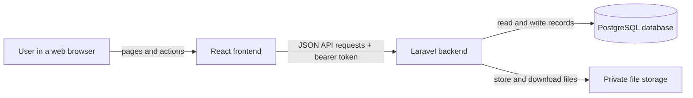
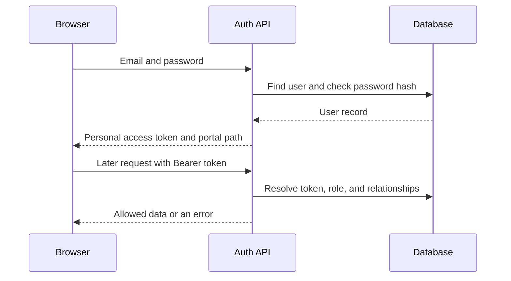
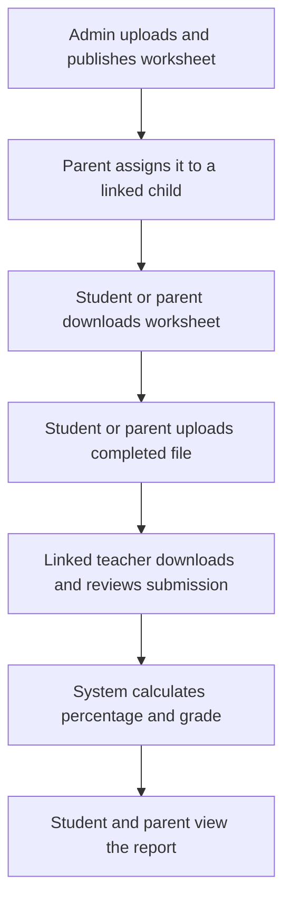

# System Architecture

## Overview

EduSphere is one web application with a React frontend and a Laravel backend. The frontend is what users see. The backend applies rules, reads and writes the database, and controls file downloads.

## Frontend

The frontend is built with React and plain CSS. Vite is the build tool; it combines and prepares the frontend files for the browser.

The active entry file is `resources/js/app.jsx`, which loads `FrontendApp.jsx`. A small custom router changes pages without reloading the whole site. `AppContext.jsx` holds the signed-in user and login token. Axios sends requests to `/api`.

The active application routes include the public home and information pages, login and sign-up, role dashboards, profile editing, the worksheet list and details, and the administrator worksheet panel. Other page files in `resources/js/pages` are not automatically active.

## Backend

The backend uses Laravel 10 on PHP 8.1 or later. Laravel is a framework: a set of reusable tools for handling web requests, validation, security, and database access.

- Routes in `routes/api.php` map URLs to controller actions.
- Controllers in `app/Http/Controllers/Api` run each request.
- Form requests in `app/Http/Requests` validate incoming values and some role rules.
- Models in `app/Models` represent database records and relationships.
- `ManualReviewService` performs marking and report creation as one safe database operation.
- Middleware and the worksheet policy decide whether a request is allowed.

## Database

PostgreSQL is the configured production database. Tests use a temporary SQLite database. Laravel Eloquent is the database layer; it turns model operations into database queries.

Migrations in `database/migrations` build the schema in order. Foreign keys connect related records and prevent broken links. See [Database Documentation](Database_Documentation.md).

## Authentication and authorization

Authentication answers “Who is this user?” Authorization answers “May this user perform this action?”

Laravel Sanctum creates personal access tokens. The browser sends the token in an `Authorization: Bearer ...` header. Role checks provide broad access control. Relationship checks add a second layer, such as confirming that a parent owns the child link or a teacher is linked to the student.

## API

The API uses HTTP requests and JSON responses. JSON is a simple text format for structured data. All application endpoints begin with `/api`. Login and registration are public; the other application endpoints require a token.

File upload requests use `multipart/form-data`, a browser format that can carry both text fields and a file. Download endpoints return the original file rather than JSON.

See [API Documentation](API_Documentation.md) for every endpoint.

## Storage

Worksheet files are stored under `storage/app/worksheets`. Completed submissions are stored under `storage/app/submissions`. The database stores the internal path and original file information.

These files are not exposed as public web links. The backend first checks permission and file existence, then sends an authorized download. In Docker, a named volume keeps application storage when containers restart.

## Main learning flow

## Deployment layout

The supplied Docker setup builds the React assets, runs PHP-FPM for Laravel, uses Nginx as the web server, and connects to PostgreSQL 16. PHP-FPM runs PHP code; Nginx receives browser traffic and passes API and page requests to PHP.
